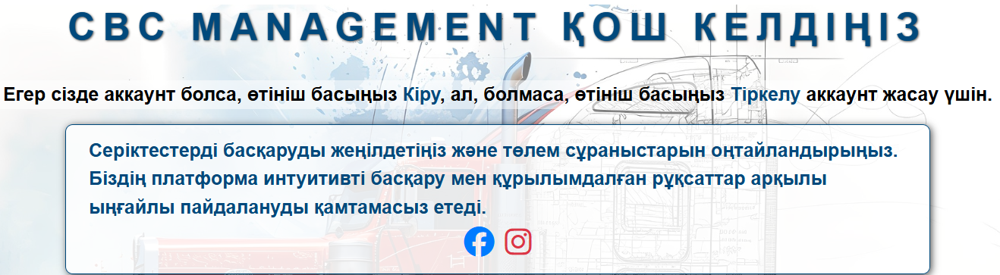
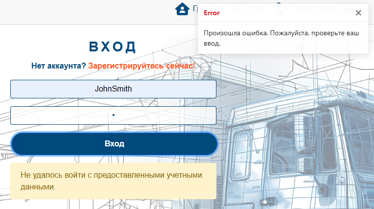
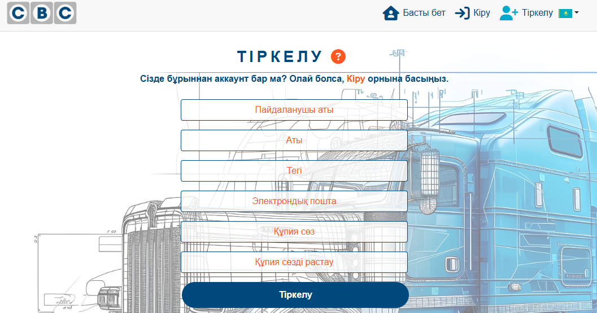
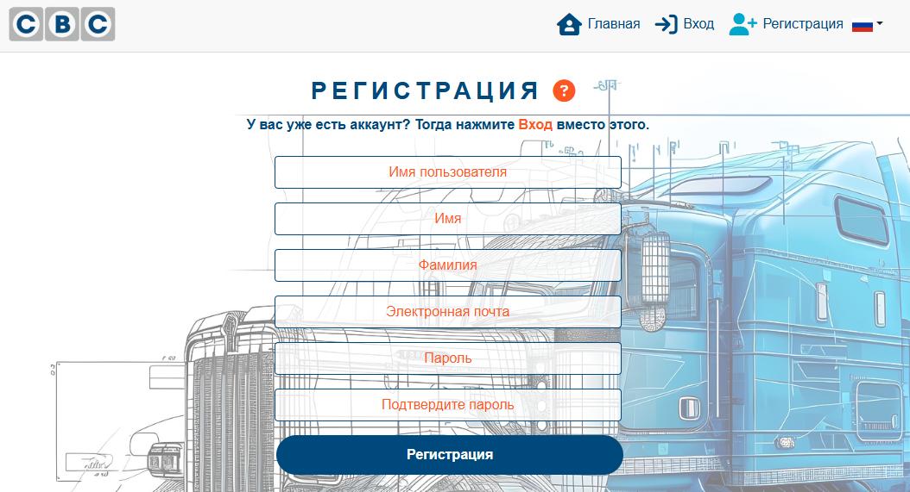
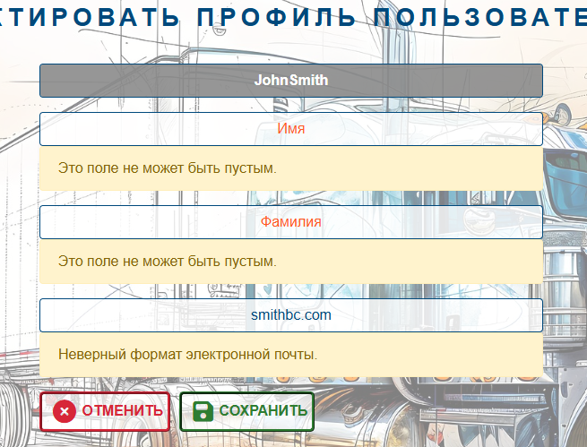
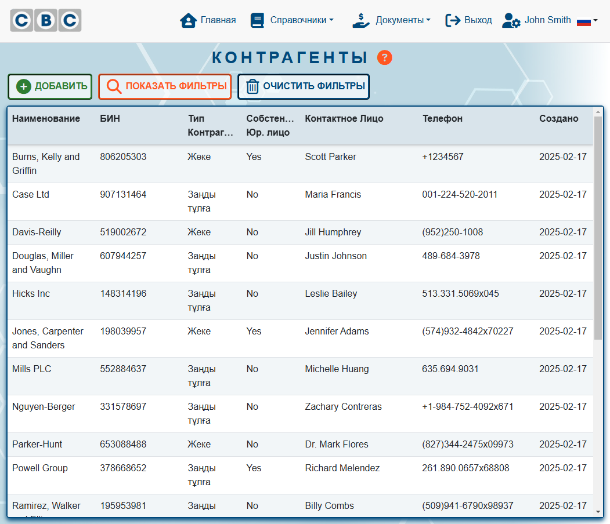
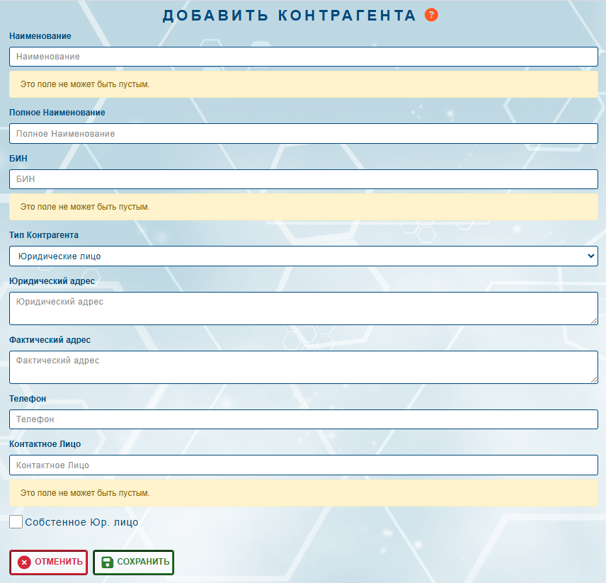

# PAYMENT MANAGEMENT

The **Payment Management System** is a web-based platform designed for efficient financial transaction management. It ensures **secure authentication**, **user role management**, and an **intuitive interface** for handling partners and payment requests.

🔗 **Website:** [link](https://payment-management-biv-cc4a949bb411.herokuapp.com/)

🔗 **Repository:** [link](https://github.com/BogdanovaIV/payment-management)


## Business Model

### Value Proposition
- **Secure & Structured Management:** A centralized platform for managing partners and payment requests.
- **User-Friendly Interface:** Simplifies navigation and enhances the user experience.
- **Advanced Security:** Authentication, role-based access, and pessimistic locking for data integrity.
- **Efficient Data Handling:** Advanced filtering, infinite scrolling, and mobile responsiveness.

### Target Audience</br>
1. **Business Owners & Organizations**</br>
**Who They Are:**</br>
🎯 Entrepreneurs, small business owners, and corporate representatives looking to manage financial transactions and partnerships efficiently.</br>
**How the Platform Helps:** </br>
✅ **Partner Management:** Easily add, edit, and view partner details.</br>
✅ **Payment Requests:** Monitor and manage outgoing payments.</br>
✅ **Secure Access:** Role-based authentication for sensitive data.</br>
✅ **Conflict Prevention:** Pessimistic locking prevents simultaneous edits..</br>

2. **Finance & Accounting Professionals**</br>
**Who They Are:**</br>
🎯 Accountants, financial analysts, and corporate finance teams responsible for managing business transactions.</br>
**How the Platform Helps:**</br>
✅ **Streamlined Payment Requests:** Create, edit, and track payment requests seamlessly.</br>
✅ **Transaction Filtering:** Easily filter payment requests and partner information.</br>
✅ **Error Prevention:** Automated validation prevents errors, such as duplicate or incomplete entries.</br>

3. **New Users & Prospective Clients**</br>
**Who They Are:**</br>
🎯 Individuals or businesses considering joining the platform.</br>
**How the Platform Helps:**</br>
✅ **Smooth Onboarding**: Secure and user-friendly sign-up and authentication.</br>
✅ **Clear Platform Overview**: The home page provides insights into features and benefits.</br>
✅ **Social Media Integration**: Access resources and support via social channels.</br>

4. **Technical Users & IT Support Teams**</br>
**Who They Are:**</br>
🎯 IT personnel responsible for maintaining and troubleshooting system operations.</br>
**How the Platform Helps:**</br>
✅ **Data Integrity & Error Handling**: Ensures smooth operation through validation and error messages.</br>
✅ **Conflict-Free Editing**: Pessimistic locking prevents multi-user conflicts.</br>
✅ **Role-Based Security**: Ensures appropriate access control for different users.</br>

### Marketing Strategy</br>
#### Revenue Streams</br>
💰 **Subscription Plans:** Premium features for businesses.</br>
💰 **Transaction Fees:** Processing payments (if applicable).</br>
💰 **Customization Services:** Tailored solutions for enterprises</br>

#### Key Features</br>
🚀 **Navigation Bar:** Access authentication, user profile, dictionaries, and transactions.</br>
🔐 **Authentication System:** Secure sign-up, login, and password management.</br>
👤 **User Profile Management:** Read-only details with edit and password change options.</br>
🤝 **Partner Management:**</br>
   - View, add, edit, and delete partners with validation checks.</br>
   - Prevents deletion of referenced partners.</br>
📑 **Payment Request Management:**</br>
   - View, add, edit, and delete payment requests with validation criteria.</br>
   - Tracks invoices, amounts, deadlines, and comments.</br>
   - Assigns requests to the logged-in user automatically.</br>
🔒 **Security & Data Integrity:**</br>
   - Role-based access control for sensitive data.</br>
   - Pessimistic locking for concurrent editing.</br>

#### Key Resources</br>
- **Cloud Hosting**: Ensures scalability and availability.</br>
- **Secure Database:** Stores partner and transaction records safely.</br>
- **Authentication Framework:** Manages user authorization and security.</br>

#### Customer Relationships</br>
📞 **Support System:** Help desk and ticketing for issue resolution.</br>
📘 **User Documentation:** Guides, FAQs, and onboarding tutorials.</br>
💬 **Community Engagement:** Feedback channels and feature requests.</br>

#### Promotional Channels</br>
🔎 **SEO Optimization:** Improves search visibility.</br>
📱 **Social Media Marketing:** Engaging content on LinkedIn, Facebook, and Twitter.</br>
📧 **Email Campaigns:** Newsletters to attract users.</br>
📢 **Paid Ads:** Google Ads and social media promotions.</br>
✍️ **Content Marketing:** Blog posts and tutorials.</br>

#### Cost Structure</br>
💼 **Hosting & Infrastructure:** Maintenance costs.</br>
🛠 **Development & Updates:** Continuous improvements.</br>
🛡 **Security & Compliance:** Ensuring safe transactions.</br>

#### Competitive Advantage</br>
✔ **Intuitive UI:** Easy-to-use interface for financial management.</br>
✔ **Advanced Security:** Pessimistic locking prevents data conflicts.</br>
✔ **Smart Filtering:** Infinite scrolling for better navigation.</br>
✔ *Role-Based Access:* Maintains data privacy and integrity.</br>

## User Stories

### First Time Visitors
| **ID** | **User Story** | **Acceptance Criteria** |
|-|-|-|
| [4](https://github.com/BogdanovaIV/payment-management/issues/4) | As a user, I want to be able to log in, log out, and register an account securely so that I can access the app and my personal data with a safe and efficient authentication process using tokens, and if my account is not verified by the administrator, I can still see a welcome message with information that all features will be available after my account is checked. | - Registration: As a user, I can create a new account by providing a username, email, first name, last name, and password. After successful registration, I will be able to log in immediately with the credentials I used during registration. <br> - Login: As a registered user, I can log in using my username and password. Upon successful login, I will be granted access to the app and receive a token to store in my browser for session management. My login credentials will be securely sent to the server, and I will be redirected to the dashboard or homepage if successful. <br> - Welcome Message for Unverified Users: As a user, if my profile is not yet verified (i.e., checked is False), I will be redirected to the home page. On the home page, I will see a welcome message explaining that all features will be available after my profile is verified by the administrator. <br> - Logout: as a logged-in user, I can log out from the app. Once logged out, my token will be cleared, and I will be redirected to the login page. I will no longer be able to access protected parts of the app after logging out. <br> - Protected Routes: As a user, I can access certain pages only after logging in. If I try to access these pages without being logged in, I will be redirected to the login page. <br> - Session Management: As a user, my session will be maintained using a token stored in my browser (localStorage or sessionStorage). When I refresh the page, I will remain logged in as long as the token is valid. <br> - Error Handling: If I enter incorrect credentials during login, I will be notified with a helpful error message. If I attempt to access a protected route without being logged in, I will be redirected to the login page. |
| [5](https://github.com/BogdanovaIV/payment-management/issues/5) | As a user, I want to be able to select my preferred language so that I can navigate and use the website in a language I understand. | - Users can switch between available languages via a language selector. <br> - The selected language persists across pages and sessions. <br> - If a user is logged in, their preferred language is stored in the backend. <br> - If a user is not logged in, their language preference is saved in localStorage. <br> - All UI elements (buttons, menus, messages) are translated based on the selected language. |
| [14](https://github.com/BogdanovaIV/payment-management/issues/14) | As a user, I want to see clear instructions, so that I can understand how to use its features effectively. Users should have access to concise, easy-to-understand instructions. These instructions should be displayed within the page itself, guiding users on how to interact with different elements and complete tasks efficiently. | - The text should be simple, clear, and concise. <br> - If applicable, use bullet points, numbered steps, or short paragraphs for readability. |

### Returning or Regular Visitors
| **ID** | **User Story** | **Acceptance Criteria** |
|-|-|-|
| [6](https://github.com/BogdanovaIV/payment-management/issues/6) | As a user, I want to be able to change my profile data (interface language, first name, last name, email, and password) so that I can keep my personal information up-to-date and customize my user experience. | - The user should be able to edit their first name, last name, and email address in the input fields. <br> - The user should be able to change their password by entering a new one in a password input field. |
| [7](https://github.com/BogdanovaIV/payment-management/issues/7) | As a user, I can create a partner, view all partners in a table, and filter partners. Users should be able to manage partners efficiently. They can create new partners, view a list of all partners in a structured table, and filter partners based on relevant criteria. | - Create Partner A user can add a new partner by filling out a form with the following fields: <br> Trade Name (required), Full Name, BIN (Business Identification Number), Partner Type (Company or Individual), Legal Address, Actual Address, Phone Number, Contact Person, and Is Own Partner (Boolean field). <br> - The partner is saved in the system with automatic timestamps (created_at, updated_at). <br> - View Partners in a Table A user can see all partners in a tabular format. <br> - The table includes the following columns: Trade Name, BIN, Partner Type, Is Own Partner, Contact Person, Phone Number, and Created At. <br> - The table is sorted by trade_name by default. <br> - Filter Partners A user can filter partners using the following criteria: Trade Name (text search), BIN (text search), Partner Type (dropdown: Company, Individual), Is Own Partner (checkbox: Yes/No), and The table updates dynamically based on filter selection. |
| [8](https://github.com/BogdanovaIV/payment-management/issues/8) | As a user, I want to be able to create, view, update, and delete Payment Requests so that I can manage financial transactions efficiently. The system should allow users to perform CRUD (Create, Read, Update, Delete) operations on PaymentRequest records. The user must select a payer and recipient from partner's list. The payment request should include invoice details, amount, priority, deadline, and optional comments. | 1. Create a Payment Request: <br> - The user can open a form to create a new PaymentRequest. <br> - The user must select payer and recipient. <br> - The user must enter invoice details, amounts, priority, and deadline. <br> - The system should validate the form and display appropriate error messages if required fields are missing or incorrect. <br> - Upon successful creation, the request should be saved and appear in the list of payment requests. <br> 2. View Payment Requests: <br> - The user can see a list of all PaymentRequest records sorted by deadline. <br> - Each entry should display key details such as recipient, payment amount, and deadline. <br> - The user can click on a request to view its full details. <br> 3. Update a Payment Request: <br> - The user can edit an existing PaymentRequest. <br> - Only the creator of the request. <br> - The system should allow updates to payment details while enforcing validation rules. <br> 4. Delete a Payment Request: <br> - The user can delete a PaymentRequest if they have the necessary permissions. <br> - The system should prompt for confirmation before deletion. <br> - Once deleted, the request should be removed from the database. |
| [9](https://github.com/BogdanovaIV/payment-management/issues/9) | As a user, I want to see clear and consistent error messages so that I can understand and resolve issues easily. Users should receive error messages in a structured and visually consistent manner across the application. A reusable error-handling function should be implemented to capture errors and display appropriate notifications (e.g., Toast messages or UI alerts). | 1. Error Handling Functionality: <br> - The system should have a centralized function to handle errors from API requests, form submissions, and unexpected failures. <br> - The function should classify errors (e.g., network errors, authentication errors, server errors) and provide corresponding messages. <br> - The function should log errors for debugging purposes without exposing sensitive details to the user. <br> 2. Notification System (Toast Messages/UI Alerts): <br> - Error messages should be displayed as Toast notifications or UI alerts. <br> - Different error types should have distinct styles (e.g., red for critical errors, yellow for warnings). <br> - Messages should be auto-dismissed after a few seconds but allow manual dismissal. |
| [10](https://github.com/BogdanovaIV/payment-management/issues/10) | As a user, I want to delete "Partners" and "Payment Requests", so that I can manage my data efficiently. However, the system must prevent deletion if the item is referenced in other records. | - Successfully Delete a "Partner" or "Payment Request". <br> - Prevent Deleting a "Partner" Referenced in Other Records |
| [11](https://github.com/BogdanovaIV/payment-management/issues/11) | As a user of the system I want to be notified when another user is already editing a "Partner" or "Payment Request" so that I do not make conflicting changes and avoid data inconsistencies. | 1. Locking an Item: <br> - When User A clicks "Edit" on a Partner or Payment Request, the system locks the item. <br> - Other users trying to edit the same item see a message: "This item is being edited by another user." <br> 2. The lock is released when: <br> - User A saves the changes. <br> - User A cancels the edit. <br> - User A is inactive for 20 minutes. <br> - Unlocking the Item: <br> - If a user closes the page or loses connection, the lock is released after 20 minutes of inactivity. <br> - Admins can force unlock if necessary. <br> 3. Lock Expiry: <br> - If a user locks an item but does not save/cancel within 5 minutes, the lock is automatically removed to prevent permanent blocking. |
| [12](https://github.com/BogdanovaIV/payment-management/issues/12) | As a user, I want to set and update the status of a payment request so that I can track its progress efficiently. Users need to manage the lifecycle of payment requests by assigning statuses such as Draft, Pending Approval, Approved, and Paid. | - When creating a payment request, the status is automatically set to Draft. <br> - The system prevents unauthorized status changes (e.g., skipping approval). <br> - Users can filter payment requests by status. |
| [13](https://github.com/BogdanovaIV/payment-management/issues/13) | As a user, I want to be redirected to the home page if I try to access a page I am not authorized to view, so that I can return to the main page where I can continue using the site. | - The user goes to pages: Partners, Add/Edit/View/Delete Partners, Payment Requests, Add/Edit/View/Delete Payment Request and User Profile. The system checks whether the user is logged in (authenticated). If the user is not logged in, they should be redirected to the home page. |

### Developers
| **ID** | **User Story** | **Acceptance Criteria** |
|-|-|-|
| [1](https://github.com/BogdanovaIV/payment-management/issues/1) | As a developer, I want to create a Django project and store sensitive settings (SECRET_KEY, DEBUG, ALLOWED_HOSTS) in environment variables so that I can secure sensitive information and keep my settings configurable. | - Create the Django project. <br> - Move SECRET_KEY, DEBUG, and ALLOWED_HOSTS to environment variables. <br> - Update settings.py to read these values. <br> - Create a .env file for storing these variables and add it to .gitignore.|
| [2](https://github.com/BogdanovaIV/payment-management/issues/2) | As a developer I want to create a User app with a UserProfile model linked to the Django User model, REST Framework serializers, and Profile details API endpoints so that users can view and update their profiles securely using API endpoints with authentication and proper validation. | - Create the User App: <br> - Add a UserProfile model linked to the User model using a OneToOneField. Include a checked BooleanField to track user verification (default: False). <br> - Automatically create a UserProfile instance for every new User via Django signals (post_save). <br> - Create a UserProfileSerializer to serialize UserProfile data. Include serializer method fields (e.g., full name) as needed. <br> - Add Profile API Views: GET: Fetch user profile details (e.g., username, email, checked status). PUT: Allow authenticated users to update their profile information. <br> - Secure the profile API endpoints to allow access only to authenticated users. <br> - Ensure users can only view or edit their own profiles. |
| [3](https://github.com/BogdanovaIV/payment-management/issues/3) | As a developer I want to deploy my Django application to Heroku so that I can make my application accessible on the web. | - Set Up Heroku Account. <br> - Prepare the Django App for Deployment. <br> - Create a Procfile. <br> - Configure Environment Variables on Heroku. |

## Features

### Existing Features

The system provides users with access to view partners and payment requests. However, if a user's profile has not been verified (i.e., if the ```checked``` field is set to ```False```), all system features remain inaccessible until verification is completed.

Additionally, throughout the entire process of adding, editing, and deleting records, the system ensures transparency by notifying users about the execution status of their actions. These notifications help users stay informed about the success or failure of their requests, ensuring a smooth and clear user experience.

It also supports **language translation** in **English, Kazakh, and Russian** through a built-in language selector.

__Navigation Bar__
 
 The navigation bar is a core component available on all pages, ensuring seamless access to essential features and functionalities. 

 1. **Contents & Functionalities:**
    - **Logo Image** – A clickable logo that redirects users to the Home page.
    - **Home Link** – A direct link to the Home page.
    - **Language Selector** – A flag icon that opens a drop-down menu, allowing users to choose the current language.

    

    - **Authentication Links** (Visible only to non-authorized users):
        - **Sign In** – Redirects to the Sign In page.
        - **Sign Up** – Redirects to the Sign Up page.
    
     

     

          
    
    - **Dictionaries** Drop-Down Menu (Visible only to authorized users):
       - **Partners** – Redirects to the Partner list page.
    - **Transactions** Drop-Down Menu (Visible only to authorized users):
       - **Payment Requests** – Redirects to the Payment Requests list page.
    - **User-Specific Links** (Visible only to authorized users):
       - **User Name (current user's name)** – Redirects to the User Profile page.
       - **Sign Out** -  – Redirects to the Sign Out page.

    

    

    
 
 2. **User Experience & Design Enhancements:**
    - All buttons feature a **hover effect** for better interactivity.

    

    - The currently active page is visually highlighted by a color change in the corresponding button.
    - A **toggle menu** is available for better usability on small-screen devices.

    

    - The navigation structure ensures users can easily access key sections without relying on the browser’s "Back" button.
  
  __Home__
The Home Page serves as the main entry point for users, welcoming them to the platform and providing essential navigation options. It includes authentication prompts, key features, benefits, and social media links.


  

1. **User Authentication Messages:**
    - Non-authenticated users are prompted to create an account (**Sign Up**) or sign in (**Sign In**).

    

    

    

    - The **Sign In** and **Sign Up** links feature a **hover effect**, changing color and slightly enlarging for better interactivity.

    

    - Authorized users with unverified profiles receive a notification regarding their verification status.

    

    

    

2. **Feature Highlights:**
    - Links to **Instagram** and **Facebook** allow users to stay connected.
    - Each link features a **hover effect**, changing color and slightly enlarging the icon for improved interactivity and engagement.

    

 __Sign In__
 The Sign In page allows registered users to access their accounts securely. It includes fields for entering login credentials, authentication feedback, and password recovery options.

 

 

 

 1. **User Authentication:**
    - Users enter their **Username** and **Password** to sign in.
    - The **Sign In** button features a hover effect, changing color and slightly enlarging for better interactivity.

    

 2. **Error Handling & Feedback:**
    - If incorrect credentials are entered, an error message is displayed, guiding users to correct their input.

     

     

     

     

     

     

 3. **New User Registration:**
    - Users who do not have an account can navigate to the **Sign Up** page.
    - The **Sign Up**S link includes a hover effect, enhancing visibility and engagement.

    

__Sign Up__

The sign-up form allows new users to create an account securely. All fields in the form are required, and the inputs must meet validation criteria.






1. **Existing Users:**
    - Users who do have an account can navigate to the **Sign In** page.
    - The **Sign In**S link includes a hover effect, enhancing visibility and engagement.

    

2. **User Registration:**
    - New users must enter the following details to create an account:
      - **Username**
      - **First Name**
      - **Last Name**
      - **Email**
      - **Password**
      - **Confirm Password**
    - The **Sign In** button features a hover effect, changing color and slightly enlarging for better interactivity.

    

 3. **Error Handling & Feedback:**
    - If any field is left blank or contains an incorrect format, an error message is displayed, guiding users to correct their input.

    

    

    
 
 4. **Instruction**
    - The system provides clear instructions, explaining how to complete the form correctly, ensuring a smooth registration process.

   

   

   

    - The **Instruction** button features a hover effect, changing color and slightly enlarging for better visibility and usability.

   

__User's Profile__

The profile page presents the user's details in a read-only format, ensuring that no fields can be edited directly. It provides three key action buttons:


   - **Edit Profile** – Allows users to navigate to a separate page where they can update their profile information.
   - **Change Password** – Redirects users to the password update page for enhanced account security.
   - **Instructions** – Displays guidance on how to manage account settings.

   

   

   

   - All buttons feature a hover effect, changing color and slightly enlarging to improve visibility and user interaction.

   

__Edit User's Profile__

The edit profile page allows users to update their personal details in a structured and user-friendly manner. All input fields support validation to ensure data accuracy.


1. **Editing User Profile**
    - Users can modify the following details::
      - **First Name**
      - **Last Name**
      - **Email**

    - The page includes two key action buttons:
      - **Save** – Saves the changes and updates the profile.
      - **Cancel** – Navigates back to the previous page without saving any changes.
      - All buttons feature a hover effect, changing color and slightly enlarging to improve visibility and user interaction.

      

2. **Error Handling & Feedback:**
    - If a required field is left blank or contains an incorrect format, an error message is displayed, guiding the user to correct the input.

    

    

    

3. **Instruction**
    - A dedicated Instructions section provides clear guidelines on how to update profile details correctly.
    - The Instruction button features a hover effect, improving visibility and user interaction.

    

    

    

__Change Password__

The Change Password page allows users to securely update their account passwords through a structured and user-friendly interface.


1. Password Update Process
   - Users are required to enter the following details:
      - **Old Password** – The current password for authentication.
      - **New Password** – A new password that meets security requirements.
      - **Confirm New Password** – Must match the new password to ensure accuracy.
   - Action Buttons:
      - **Save** – Saves the changes and updates the profile.
      - **Cancel** – Navigates back to the previous page without saving any changes.
      - All buttons feature a hover effect, changing color and slightly enlarging to improve visibility and user interaction.
- **Error Handling & Feedback:**
    - If a required field is left blank or contains an incorrect format, an error message is displayed, guiding the user to correct the input.
    - If the old password is incorrect, an error message prevents the update.
    - If the new password does not meet security criteria (e.g., minimum length, special characters), an error message appears.
    - If the new password and confirmation password do not match, an error message is displayed.

- **Instruction**
    - A dedicated Instructions section provides clear guidelines on how to update profile details correctly.
    - The Instruction button features a hover effect, improving visibility and user interaction.
      
    

    

    

__Partners List__

The **Partner List** enables users to efficiently view, filter, and manage Partners. The interface adapts to different screen sizes and includes advanced filtering, selection, and infinite scrolling functionalities.




1. **Responsive Display:**
   - Displays Partners in a table format on larger screens.
   - Shows individual cards on smaller screens for improved accessibility.

   

2. **Action Buttons:**
   - **Add** - Redirects users to a new page to enter Partner details.
   - **Show Filters** - Displays filter options to refine the list
      - Users can input values to narrow down results.
      - Automatic validation prevents incorrect date ranges (e.g., start date cannot be after end date).
      - Clicking the trash can icon clears an individual filter field.
      - When filters are displayed, the button text changes to **Hide Filters**.

      

   - **Clear Filters** - Resets all filters.
   - All buttons feature a hover effect, changing color and slightly enlarging to improve visibility and user interaction.

   

3. **Managing Partner Details**
   - To edit Partner details, users can click anywhere on a row (for larger screens) or any part of a card (for smaller screens) to access the details page.

4. **Infinite Scrolling:**
   - The list automatically loads more data as the user scrolls.
   - If additional pages exist, new Partners appear without requiring a manual refresh. 
5. **Handling No Results:**
   - If no matching Partners are found, a ‘No results found’ message is displayed.
6. **Loading Indicator:**
   - A spinner animation appears while data is loading.
   - Once loaded, the Partner details are displayed instantly.

   

7. **Instruction**
    - A dedicated Instructions section provides clear guidelines on how to update profile details correctly.
    - The Instruction button features a hover effect, improving visibility and user interaction.

    

    

    

__Add Partner__

The **Add Partner Page** allows users to create a Partner record by entering relevant details and ensuring all required fields meet validation criteria. 


1. **Adding a Partner**
   - Users must provide the following details:
      - **Trade Name**:
         - Required field.
         - Maximum 255 characters.
      - **Full Name**: 
         - Maximum 255 characters.
      - **Business Identification Number (BIN)**:
         - Required field.
         - Maximum 20 characters.
      - **Partner Type**:
         - The dropdown list.
      - **Legal Address**:
         - Supports multiline input.
      - **Actual Address**:
         - Supports multiline input.
      - **Phone Number**:
         - Must be in international format (e.g., +1234567890).
         - Maximum 255 characters.
      - **Own Partner**:
         - Indicates whether the Partner is owned by the organization.
         - Users can check or uncheck this option as needed.
   - Action Buttons:
      - **Save** – Saves the Partner details.
      - **Cancel** – Navigates back to the previous page without saving any changes.
      - All buttons feature a hover effect, changing color and slightly enlarging to improve visibility and user interaction.
- **Error Handling & Feedback:**
    - If a required field is left blank or contains an incorrect format, an error message is displayed, guiding the user to correct the input.

   

   

   

- **Instruction**
    - A dedicated Instructions section provides clear guidelines on how to update profile details correctly.
    - The Instruction button features a hover effect, improving visibility and user interaction.

    

    

    

__View Partner Details__

The **Partner View** allows users to view Partner details in a read-only format. From this page, users can navigate to the **Edit** or **Delete** page.


1. **Read-Only Fields**
   - All Partner details are displayed in a structured format.
   - Fields cannot be edited from this page.

2. **Action Buttons**:
      - **Edit** –  Redirects to the **Edit Partner** page, allowing modifications.
      - **Delete** –  Redirects to the **Delete Partner** page for removal confirmation.
      - **Cancel** – Navigates back to the previous page without saving any changes.
      - All buttons feature a hover effect, changing color and slightly enlarging to improve visibility and user interaction.

- **Instruction**
    - A dedicated Instructions section provides clear guidelines on how to update profile details correctly.
    - The Instruction button features a hover effect, improving visibility and user interaction.

    

    

    

__Edit Partner__

The **Edit Partner Page** allows users to edit a Partner record by entering relevant details and ensuring all required fields meet validation criteria. 


1. **Edditing a Partner**
   - Users must provide the following details:
      - **ID**:
         - Read-only field.
      - **Created At**:
         - Read-only field.
      - **Updated At**:
         - Read-only field.
      - **Trade Name**:
         - Required field.
         - Maximum 255 characters.
      - **Full Name**: 
         - Maximum 255 characters.
      - **Business Identification Number (BIN)**:
         - Required field.
         - Maximum 20 characters.
      - **Partner Type**:
         - The dropdown list.
      - **Legal Address**:
         - Supports multiline input.
      - **Actual Address**:
         - Supports multiline input.
      - **Phone Number**:
         - Must be in international format (e.g., +1234567890).
         - Maximum 255 characters.
      - **Own Partner**:
         - Indicates whether the Partner is owned by the organization.
         - Users can check or uncheck this option as needed.
   - Action Buttons:
      - **Save** – Saves the Partner details.
      - **Cancel** – Navigates back to the Partner's List page without saving any changes.
      - All buttons feature a hover effect, changing color and slightly enlarging to improve visibility and user interaction.
- **Error Handling & Feedback:**
    - If a required field is left blank or contains an incorrect format, an error message is displayed, guiding the user to correct the input.
- **Instruction**
    - A dedicated Instructions section provides clear guidelines on how to update profile details correctly.
    - The Instruction button features a hover effect, improving visibility and user interaction.

__Delete Partner__

The **Delete Partner Page** allows users to remove a Partner record from the system permanently.


- **Deleting a Partner**
   - Users have to confirm the deletion in the prompt to proceed.
   - This action is irreversible—once deleted, the Partner cannot be restored.
   - Before deletion, the system checks if the Partner is referenced in other records.
   - If deletion is not possible, an error message will appear: 'Cannot delete this item because it is referenced in another record.'
- **Action Buttons**:
   - **Delete** – Remove the Partner.
   - **Cancel** – Navigates back to the previous page without saving any changes.
   - All buttons feature a hover effect, changing color and slightly enlarging to improve visibility and user interaction.

__Payment Request's List__

The **Payment Request's List** enables users to efficiently view, filter, and manage Payment Requests. The interface adapts to different screen sizes and includes advanced filtering, selection, and infinite scrolling functionalities.


1. **Responsive Display:**
   - Displays Payment Requests in a table format on larger screens.
   - Shows individual cards on smaller screens for improved accessibility.

   

2. **Action Buttons:**
   - **Add** - Redirects users to a new page to enter Payment Requests details.
   - **Show Filters** - Displays filter options to refine the list
      - Users can input values to narrow down results.
      - Automatic validation prevents incorrect date ranges (e.g., start date cannot be after end date).
      - Clicking the trash can icon clears an individual filter field.
      - When filters are displayed, the button text changes to **Hide Filters**.
      - When the form opens, the User filter is automatically set to the current user.

   - **Clear Filters** - Resets all filters.
   - All buttons feature a hover effect, changing color and slightly enlarging to improve visibility and user interaction.

3. **Foreign Key Selection**
   - Some filters require selecting values from another list (e.g., categories, references).
   - The system opens a selection modal for easy assignment.

   

4. **Managing Payment Requests Details**
   - To edit Payment Requests details, users can click anywhere on a row (for larger screens) or any part of a card (for smaller screens) to access the details page.

5. **Infinite Scrolling:**
   - The list automatically loads more data as the user scrolls.
   - If additional pages exist, new Partners appear without requiring a manual refresh. 
6. **Handling No Results:**
   - If no matching Payment Requests are found, a ‘No results found’ message is displayed.
7. **Loading Indicator:**
   - A spinner animation appears while data is loading.
   - Once loaded, the Partner details are displayed instantly.
8. **Instruction**
    - A dedicated Instructions section provides clear guidelines on how to update profile details correctly.
    - The Instruction button features a hover effect, improving visibility and user interaction.

__Add Payment Request__

The **Add Payment Request Page** allows users to create a Payment Request record by entering relevant details and ensuring all required fields meet validation criteria. 


1. **Adding a Payment Request**
   - Users must provide the following details:
      - **Payer**:
         - Required field.
         - Selected the payer from the available options.
      - **Recipient**: 
         - Required field.
         - Selected the recipient from the available options.
      - **Invoice Number**:
         - Required field.
         - Maximum 50 characters.
      - **Invoice Date**:
         - Required field.
      - **Invoice Amount:**:
         - The value must be greater than or equal to 0.
      - **Payment Priority**:
         - The value must be between 1 and 10.
      - **Payment Amount**:
         - The value must be greater than or equal to 0..
      - **Deadline**:
         - Optional field.
      - **Comment**:
         - Required field.
      - **User**:
         - Non-visiable.
         - Set automatically to the current user.
   - Action Buttons:
      - **Save** – Saves the Payment Request details.
      - **Cancel** – Navigates back to the previous page without saving any changes.
      - All buttons feature a hover effect, changing color and slightly enlarging to improve visibility and user interaction.
**Foreign Key Selection**
   - Some fields require selecting values from another list (e.g., categories, references).
   - The system opens a selection modal for easy assignment.
- **Error Handling & Feedback:**
    - If a required field is left blank or contains an incorrect format, an error message is displayed, guiding the user to correct the input.
- **Instruction**
    - A dedicated Instructions section provides clear guidelines on how to update profile details correctly.
    - The Instruction button features a hover effect, improving visibility and user interaction.

__View Payment Request Details__

The **Payment Request View** allows users to view Payment Request details in a read-only format. From this page, users can navigate to the **Edit** or **Delete** page.


1. **Read-Only Fields**
   - All Partner details are displayed in a structured format.
   - Fields cannot be edited from this page.

2. **Action Buttons**:
      - **Edit** –  Redirects to the **Edit Payment Request** page, allowing modifications.
      - **Delete** –  Redirects to the **Delete Payment Request** page for removal confirmation.
      - **Cancel** – Navigates back to the previous page without saving any changes.
      - All buttons feature a hover effect, changing color and slightly enlarging to improve visibility and user interaction.

- **Instruction**
    - A dedicated Instructions section provides clear guidelines on how to update profile details correctly.
    - The Instruction button features a hover effect, improving visibility and user interaction.

__Edit Payment Request__

The **Edit Payment Request Page** allows users to edit a Payment Request record by entering relevant details and ensuring all required fields meet validation criteria. 


1. **Adding a Payment Request**
   - Users must provide the following details:
      - **ID**:
         - Read-only field.
      - **Created At**:
         - Read-only field.
      - **Updated At**:
         - Read-only field.
      - **User**:
         - Read-only field.
      - **Payer**:
         - Required field.
         - Selected the payer from the available options.
      - **Recipient**: 
         - Required field.
         - Selected the recipient from the available options.
      - **Invoice Number**:
         - Required field.
         - Maximum 50 characters.
      - **Invoice Date**:
         - Required field.
      - **Invoice Amount:**:
         - The value must be greater than or equal to 0.
      - **Payment Priority**:
         - The value must be between 1 and 10.
      - **Payment Amount**:
         - The value must be greater than or equal to 0..
      - **Deadline**:
         - Optional field.
      - **Comment**:
         - Optional field.
      - **User**:
         - Non-visiable.
         - Set automatically to the current user.
   - Action Buttons:
      - **Save** – Saves the Payment Request details.
      - **Cancel** – Navigates back to the previous page without saving any changes.
      - All buttons feature a hover effect, changing color and slightly enlarging to improve visibility and user interaction.
**Foreign Key Selection**
   - Some fields require selecting values from another list (e.g., categories, references).
   - The system opens a selection modal for easy assignment.
- **Error Handling & Feedback:**
    - If a required field is left blank or contains an incorrect format, an error message is displayed, guiding the user to correct the input.
- **Instruction**
    - A dedicated Instructions section provides clear guidelines on how to update profile details correctly.
    - The Instruction button features a hover effect, improving visibility and user interaction.

__Delete Payment Request__

The **Delete Payment Request Page** allows users to remove a Payment Request record from the system permanently.


- **Deleting a Payment Request**
   - Users have to confirm the deletion in the prompt to proceed.
   - This action is irreversible—once deleted, the Payment Request cannot be restored.
- **Action Buttons**:
   - **Delete** – Remove the Payment Request.
   - **Cancel** – Navigates back to the previous page without saving any changes.
   - All buttons feature a hover effect, changing color and slightly enlarging to improve visibility and user interaction.

__Pessimistic Locking__
To prevent conflicts in multi-user environments, the system uses **pessimistic locking** when a user edits an item.

- When a user clicks **Edit**, the system **locks the item for 20 minutes**, preventing other users from making modifications.
- if no action is taken, the lock **automatically expires after 20 minutes**.
- While the item is locked, other users cannot edit or modify it.
- The lock is **released immediately** when the user:
   - **Saves** the changes.
   - **Cancels** the edit.
   - **Leaves** the page.
- The system displays a clear message to inform users when an item is locked and when it becomes available for editing again.

   

- **System Version Check:** If one user locks an item and the lock expires, another user edits it, and the first user then attempts to save changes, the system detects the version conflict and displays the message:
**"The record has been updated by another user. Please refresh the page and try again."**

   

## Design
The design of the application follows a modern and clean aesthetic, utilizing Bootstrap's standard font and a custom color palette for consistency and user-friendly interface design.

### Color Palette

| Color Name | Hex Code  | Influence on Design |
|-|-|-|
| **White** | `#ffffff` | Used as the background color of inputs and sections to create a clean, spacious, and readable interface. Enhances contrast and ensures a neutral base for other elements. |
| **Blue** | `#00497C` | Represents reliability, professionalism, and trust. It is used for links, and common font color to guide users' attention effectively. |
| **Grey** | `#8b8b8b` | Used for subtle UI elements such as secondary text, borders, and placeholders. It adds depth and hierarchy without overwhelming the design. |
| **Orange** | `#ff5722` | Used for interactive elements that require user engagement, such as warnings, notifications, and call-to-action buttons. It draws attention without being too aggressive. |
| **Red** | `#D72638` | Represents errors and critical warnings. It ensures users immediately recognize areas that require caution. |
| **Green** | `#2E7D32` | Symbolizes success, confirmation, and positive actions. Used for success messages, completed tasks, and confirmation buttons to reassure users. |

### Typography
The design uses DM Sans as the primary typeface, ensuring a modern, clean, and highly readable interface. The font was selected for its minimalist style, excellent legibility, and versatile weight options, making it suitable for both headings and body text.
```
font-family: "DM Sans", sans-serif;
```

### Technology Used (Frontend)
The frontend of the project is built using React, a popular JavaScript library for building user interfaces, along with various dependencies to enhance functionality, styling, and performance.

**Core Framework & Libraries**
- React (17.0.2): The main JavaScript library for building the user interface.
- React-DOM (17.0.2): Handles rendering React components in the browser.
- React-Router-DOM (5.3.0): Enables client-side routing for navigation.

**State Management & API Handling**
- @tanstack/react-query (4.36.1): Manages server state and caching efficiently.
- Axios (0.21.4): A promise-based HTTP client for making API requests.

**UI & Styling**
-Bootstrap (4.6.0): Provides responsive design and pre-styled components.
-React-Bootstrap (1.6.3): React components for Bootstrap styling.

**Internationalization & Localization**
- i18next (21.6.0): Handles translations and multi-language support.
- React-i18next (11.14.0): Integrates i18next with React components.

**Authentication & Security**
- JWT-Decode (3.1.2): Decodes and verifies JSON Web Tokens (JWT) for authentication.

**Data Display & Tables**
- React-Table (7.8.0): A lightweight and customizable table library for displaying data.

**Testing & Performance Monitoring**
- @testing-library/react (11.2.7): Provides utilities for testing React components.
- @testing-library/user-event (12.8.3): Simulates user interactions in tests.
- @testing-library/jest-dom (5.17.0): Extends Jest with DOM-specific matchers.
- Web-Vitals (1.1.2): Measures and reports Core Web Vitals for performance monitoring.

**Development Tools & Build System**
- React-Scripts (4.0.3): Manages the build process and development server.
- MSW (0.35.0): Mocks API requests for testing.

**Runtime & Package Management**
- Node.js (16.19.1): JavaScript runtime environment.
- NPM (8.19.3): Package manager for managing dependencies.

**Proxy Configuration**
The frontend is set to communicate with the backend via a proxy:
Proxy: http://localhost:8000/api

### Technology Used (Backend)
The backend of the project is built using Django, a high-level Python web framework, along with a set of essential libraries and tools to ensure security, scalability, and maintainability.

**Core Frameworks & Libraries**
- Django (4.2.18): The primary web framework used for rapid development and clean, maintainable design.
- Django REST Framework (3.15.2): Provides powerful API development capabilities.
- Django Filter (24.3): Enables easy filtering of querysets in Django REST Framework.
- Django-Allauth (65.3.1): Handles user authentication, registration, and account management.
- Dj-Rest-Auth (7.0.1): Adds authentication endpoints for Django REST Framework.
Django CORS Headers (4.6.0): Manages Cross-Origin Resource Sharing (CORS) policies.

**Security & Authentication**
- Djangorestframework-SimpleJWT (4.7.2): Provides JWT-based authentication.
- OAuthlib (3.2.2) & Requests-OAuthlib (2.0.0): Enables OAuth authentication.
- Cryptography (44.0.0): Ensures secure password hashing and encryption.
- Defusedxml (0.7.1): Protects against XML-related security vulnerabilities.
- Database & ORM
- Psycopg2-Binary (2.9.10): PostgreSQL adapter for Django.
- SQLParse (0.5.3): Used for parsing and formatting SQL queries.
- Dj-Database-URL (2.3.0): Simplifies database configuration using environment variables.

**Utilities & Performance**
- Gunicorn (23.0.0): WSGI HTTP Server for deploying Django applications.
- Whitenoise (6.4.0): Enables serving static files efficiently.
- Python-Decouple (3.8): Helps manage application configuration using environment variables.
- Timezone Support (Tzdata 2025.1 & Pytz 2024.2): Ensures correct handling of date and time across different regions.

**Networking & Requests**
- Requests (2.32.3): A simple and elegant HTTP library for handling API requests.
- Charset-Normalizer (3.4.1) & IDNA (3.10): Helps with character encoding and domain name resolution.
- URllib3 (2.3.0) & Certifi (2024.12.14): Enhances secure HTTP requests.

**Development & Testing**
- Faker (35.2.0): Generates fake data for testing purposes.
- Asgiref (3.8.1): Supports Django’s asynchronous capabilities.

## Data Model
The data model defines the structure and relationships of data within the system. It ensures consistency, integrity, and efficient management of user-related information.

### Entity-Relationship (ER) Diagram


### UserProfile Model
The UserProfile model extends the built-in User model by adding profile-specific attributes.

| Field | Type | Description |
|---|---|---|
| `user`| `OneToOneField(User)`| A **one-to-one** relationship with Django's built-in `User` model, ensuring that each user has a unique profile. |
| `checked` | `BooleanField` | A flag that indicates whether the user profile has been verified. Defaults to `False`. |
| `created_at` | `DateTimeField` | Stores the timestamp when the profile was created. |
| `updated_at` | `DateTimeField` | Stores the timestamp when the profile was last updated. |

### LockableModel (Abstract Model)
The `LockableModel` is an abstract Django model that provides **pessimistic locking** to prevent simultaneous modifications by multiple users. It ensures that only one user can modify an instance at a time within a defined lock duration.

| Field | Type | Description |
|---|---|---|
| `locked_by`| `ForeignKey(User, null=True, blank=True, on_delete=models.SET_NULL)`| The user who locked the instance. Can be `null` if not locked. |
| `locked_at` | `DateTimeField(null=True, blank=True)` | The timestamp when the instance was locked. Can be `null` if not locked. |
| `version` | `PositiveIntegerField(default=1)` | A version counter to track updates. Defaults to `1`. |

### Partner Model
The `Partner` model represents business partners, including companies and individuals. It is based on `LockableModel`, which means it includes functionality for record locking to prevent concurrent modifications. This is useful in multi-user environments where data integrity is critical. 
It stores key details such as trade name, legal name, identification number (BIN), and contact information. The model also tracks whether the partner is owned by the company.

**Inheritance:**
`Partner(LockableModel)` – Inherits from LockableModel, providing locking mechanisms to control concurrent data access.
| Field | Type | Description |
|---|---|---|
| `trade_name` | `CharField(255)` | The trade name of the partner. Required and indexed. |
| `full_name` | `CharField(255)` | The full legal name of the partner. Optional. |
| `bin` | `CharField(20)` | The unique Business Identification Number (BIN). Required and indexed. |
| `partner_type` | `IntegerField` | Specifies the type of partner (`Company` or `Individual`). Uses `PartnerTypes` choices. Indexed. |
| `legal_address` | `TextField` | The legal address of the partner. Optional. |
| `actual_address`| `TextField` | The actual physical address of the partner. Optional. |
| `phone_number` | `CharField(255)` | The contact phone number. Optional. |
| `contact_person`| `CharField(255)` | The main contact person for the partner. Defaults to `"Unknown"`. |
| `is_own` | `BooleanField` | Indicates if the partner is owned by the company. Indexed. |
| `created_at` | `DateTimeField` | Timestamp when the record was created. Auto-generated. |
| `updated_at` | `DateTimeField` | Timestamp when the record was last updated. Auto-updated. |

#### PartnerTypes Model
Defines the possible types of business partners. 

| Value | Name       | Description |
|-------|-----------|-------------|
| `1`   | Company   | A business entity. |
| `2`   | Individual | A private individual. |

#### Indexes:
The following indexes are added for faster queries:

- `trade_name_idx`: Index on `trade_name`
- `bin_idx`: Index on `bin`
- `partner_type_idx`: Index on `partner_type`
- `trade_name_is_own_idx`: Index on `trade_name` and `is_own`
- `bin_is_own_idx`: Index on `bin` and `is_own`
- `partner_type_is_own_idx`: Index on `partner_type` and `is_own`
- `trade_name_bin_idx`: Index on `trade_name` and `bin`

### Payment Request Model
The `PaymentRequest` model represents a financial request between a payer and a recipient, capturing key details such as invoice information, payment priority, deadlines, and status tracking. It is based on `LockableModel`, which means it includes functionality for record locking to prevent concurrent modifications. This is useful in multi-user environments where data integrity is critical. 

**Inheritance:**
`PaymentRequest(LockableModel)` – Inherits from LockableModel, providing locking mechanisms to control concurrent data access.

| Field | Type | Description |
|---|---|---|
| `created_at` | `DateTimeField` | Timestamp when the payment request was created. Auto-generated. |
| `updated_at` | `DateTimeField` | Timestamp when the payment request was last updated. Auto-updated. |
| `payer` | `ForeignKey(Partner)` | The partner initiating the payment request. Cannot be null. |
| `recipient` | `ForeignKey(Partner)` | The partner receiving the payment request. Cannot be null. |
| `payment_priority`| `PositiveIntegerField`| Priority level (1-10, default: 1). |
| `invoice_number` | `CharField(50)` | Invoice number (default: "Undefined"). |
| `invoice_date` | `DateField` | Date of the invoice (default: `now`). |
| `invoice_amount` | `PositiveIntegerField`| Invoice amount (default: 0). |
| `deadline` | `DateField` | Due date for payment (default: `now`). |
| `payment_amount` | `PositiveIntegerField`| Amount to be paid (default: 0). |
| `comment` | `TextField` | Optional comments regarding the payment request. |
| `user` | `ForeignKey(User)` | User associated with the request (default: 1). |
| `status` | `IntegerField` | Status of the request (`Draft`, `Pending Approval`, `Approved`, `Paid`). Uses `PaymentRequestStatus` choices. |

#### Status Choices
The `PaymentRequestStatus` enumeration defines possible statuses for a payment request:

| Status Name         | Value | Description |
|---------------------|-------|-------------|
| `DRAFT`            | `0`   | The request is in draft mode. |
| `PENDING_APPROVAL` | `1`   | Awaiting approval. |
| `APPROVED`         | `2`   | The request has been approved. |
| `PAID`            | `3`   | The payment has been completed. |

#### Indexes
To optimize queries, the following indexes are used:

- `payer_idx`: Index on `payer`
- `recipient_idx`: Index on `recipient`
- `invoice_number_idx`: Index on `invoice_number`
- `invoice_date_idx`: Index on `invoice_date`
- `deadline_idx`: Index on `deadline`
- `user_idx`: Index on `user`
- `status_idx`: Index on `status`
- `user_status_idx`: Index on `user` and `status`
- `payer_recipient_idx`: Index on `payer` and `recipient`

## Testing

Please refer to the [TESTING.md](TESTING.md) file for all test-related documentation.

## Deployment
The application was deployed to Heroku using the web interface. 
The live link can be found [here](https://payment-management-biv-cc4a949bb411.herokuapp.com/)
The steps to deploy are as follows:
- 1. Login to Heroku
     Go to [Heroku](https://dashboard.heroku.com/) and log in to your account. If you don't have an account, you can sign up for free.
- 2. Create a New Application
     - Click on the "New" button in the top right corner of the dashboard.
     - Select "Create new app" from the dropdown menu.
     - Enter a name for your app and select your region.
     - Click the "Create app" button.
     
- 3. Set Up Environment Variables
     - Go to the "Settings" tab of your Heroku app.
     - Click "Reveal Config Vars".
     - Add any necessary environment variables with your values: ALLOWED_HOST, DATABASE_URL, DISABLE_COLLECTSTATIC, SECRET_KEY (DJango) and STATIC_PATH
      
- 4. Buildpacks
     - Click "Add buildpack"
     - Chose Python and Nodejs
     
- 5. Connect to GitHub
     - In the "Deploy" tab, go to the "Deployment method" section.
     - Click on the "GitHub" button to connect your GitHub account to Heroku.
     - Once connected, search for the repository you want to deploy.
     - Click the "Connect" button next to your repository.
     
- 6. Automatic Deploys (Optional)
     - In the "Automatic deploys" section, you can enable automatic deploys for a specific branch (typically main or master).
     - Click "Enable Automatic Deploys" if you want Heroku to automatically deploy every time you push changes to the specified branch.
     
- 7. Manual Deploy
     - In the "Manual deploy" section, select the branch you want to deploy and click "Deploy Branch".
     - Heroku will start the deployment process. You can view the build progress in the activity feed.
     

## Local Deployment

### Prerequisites
Ensure you have the following installed:
- Python (>=3.11.6)
- Node.js (>=16.x) and npm/yarn
- PostgreSQL
- Virtual environment tools (e.g., venv or virtualenv)
- Git
### Steps to Deploy Locally
1. Clone the Repository
```
    git clone https://github.com/BogdanovaIV/payment-management
    cd payment-management
```
2.  Set Up the Backend (Django + DRF)
   - **Create and Activate a Virtual Environment**
   ```
   python -m venv venv
   source venv/bin/activate  # On macOS/Linux
   venv\Scripts\activate      # On Windows
   ```
   - **Install Dependencies**
   ```
   pip install -r backend/requirements.txt
   ```
   - **Configure Environment Variables**
   Create a `.env` and configure database settings:
   ```
   SECRET_KEY=Your secret key
   DEBUG=False
   ALLOWED_HOSTS=127.0.0.1,localhost
   DATABASE_URL=postgresql
   CLIENT_ORIGIN=http://localhost:3000,http://localhost:8000,https://localhost:3000,https://localhost:8000
   STATIC_PATH=staticfiles
   ```
   - **Apply Migrations and Create a Superuser**
   ```
   python django_api/manage.py migrate
   python django_api/manage.py createsuperuser
   ```
   - **Run the Django Development Server**
   ```
   python django_api/manage.py runserver
   ```
3. Set Up the Frontend (React)
   - **Navigate to the React App Directory**
   ```
   cd react_frontend
   ```
   - **Install Dependencies**
   ```
   npm install 
   ```
   - **Run the React Development Server**
   ```
   npm start
   ```
4. Test the Setup
   - **Backend**: Open `http://localhost:8000/api/` in your browser or use Postman.
   - **Frontend**: Open `http://localhost:3000` in your browser.

## Future Improvements

- [15](https://github.com/BogdanovaIV/payment-management/issues/15) Expand Analytics for Payment Requests, Cost Items, and Coordination.
- [16](https://github.com/BogdanovaIV/payment-management/issues/16) Add Roles to Edit Partners and Payment Requests Based on Status
- [17](https://github.com/BogdanovaIV/payment-management/issues/17) Send Editing Notification to Owner via Email

## Credits 
- [Github](https://github.com/) provided free access to a versioning system.
- [Heroku](heroku.com) provided a service to deploy an application.
- [Django](https://www.djangoproject.com/): was used to manage the core application logic, database interactions, and routing, enabling efficient handling of complex backend functionalities.
- [Django REST Framework (DRF)](https://www.django-rest-framework.org/): enabled the development of a robust API, supporting authentication, serialization, and request handling.
- [React](https://react.dev/): powered the frontend, providing a dynamic and interactive user experience with component-based architecture.
- [WhiteNoise](http://whitenoise.evans.io/): simplified static file management and improved performance by serving static files directly in production without requiring an additional server.  
- [Gunicorn](https://gunicorn.org/): a Python WSGI HTTP server used to run the application in production, ensuring stability and reliability.  
- [Bootstrap](https://getbootstrap.com/): provided pre-styled components and responsive grid systems, ensuring consistent and mobile-friendly UI elements.
- [Pxhere](https://pxhere.com/): provided free images which helped to create awesome backgrounds.
- [PostgreSQL](https://www.postgresql.org/): the primary database system used for data storage, ensuring reliability, scalability, and performance.

### Content 

- Information about authors and books was taken from free sources like Wikipedia
- [Blog](https://github.com/Code-Institute-Solutions/blog/tree/main/15_testing) is a tutorial project that covers the general principles of writing code and deploying it.

### Acknowledgments

- [Juliia Konovalova](https://github.com/IuliiaKonovalova/) was a great mentor who helped me to reveal my abilities and gave valuable advice.
- [Code Institute team](https://codeinstitute.net/) supported me and provided all the information that I needed.