## TESTING

### Purpose Of Testing

The purpose of testing is to make sure the application does not have critical errors and works properly, providing a positive experience for the user.

## Functional Testing

Functional testing ensures that all features and functionalities of the application work as expected, regardless of the device or screen size.

| **Feature** | **Action** | **Expected Result** | **Tested** | **Passed** | **Comments** |
|------------|-----------|--------------------|-----|-----|-------------|
|**Navigation bar**| | | | | |
| **Navigation bar visibility** | Open different pages of the system | The navigation bar should be visible on all pages | ✅  | ✅  |  |
| **Logo Image** | Click on the logo | The system should redirect to the Home page | ✅  | ✅ |  |
| **Home Link** | Click on the "Home" link | The system should redirect to the Home page | ✅  | ✅  |  |
| **Language Selector** | Click on the flag icon | A drop-down menu with language options should appear | ✅ | ✅ |  |
| **Sign In Link** (visible only to non-authenticated users) | Click on "Sign In" | The system should redirect to the Sign In page | ✅ | ✅ |  |
| **Sign Up Link** (visible only to non-authenticated users) | Click on "Sign Up" | The system should redirect to the Sign Up page | ✅ | ✅ |  |
| **Dictionaries Menu** (visible only to authorized users) | Log in and check if the menu appears | The "Dictionaries" menu should be visible | ✅ | ✅ |  |
| **Partners Link** | Click on "Partners" under Dictionaries menu | The system should redirect to the Partner list page | ✅ | ✅ |  |
| **Transactions Menu** (visible only to authorized users) | Log in and check if the menu appears | The "Transactions" menu should be visible | ✅ | ✅ |  |
| **Payment Requests Link** | Click on "Payment Requests" under Transactions menu | The system should redirect to the Payment Requests list page | ✅ | ✅ |  |
| **User Name Link** (visible only to authorized users) | Click on the displayed user name | The system should redirect to the User Profile page | ✅ | ✅ |  |
| **Sign Out Link** (visible only to authorized users) | Click on "Sign Out" | The user should be logged out and redirected to the Sign Out page | ✅ | ✅ |  |
| **Hover Effect on Buttons** | Hover over various buttons | Buttons should change appearance (color, underline, etc.) | ✅ | ✅ |  |
| **Active Page Highlighting** | Navigate to different pages | The active page should be highlighted with a different color | ✅ | ✅ |  |
| **Toggle Menu (Mobile View)** | Resize the browser to a mobile screen width and click the toggle button | The menu should expand and allow navigation | ✅ | ✅ |  |
| **Language Support** | Switch between Kazakh, English, and Russian | All interface elements, buttons, messages, and labels should be correctly translated | ✅ | ✅ |  |  
|**Home Page**| | | | | |
| **Sign In/Sign Up Prompt** | Visit the home page as a non-authenticated user  | "Sign In" and "Sign Up" links are visible | ✅ | ✅|  |
| **Sign In/Sign Up Hover Effect** | Hover over the "Sign In" or "Sign Up" links | Links change color and slightly enlarge | ✅ | ✅ |  |
| **Unverified Profile Message** | Log in as an authorized user with an unverified profile | A verification message is displayed | ✅ | ✅ |  |
| **Instagram & Facebook Links** | Check for Instagram and Facebook links | Links to both social media platforms are present | ✅ | ✅ |  |
| **Social Media Hover Effect** | Hover over the Instagram or Facebook links | Links change color and slightly enlarge | ✅ | ✅ |  |
| **Language Support** | Switch between Kazakh, English, and Russian | All interface elements, buttons, messages, and labels should be correctly translated | ✅ | ✅ |  | 
|**Sign In Page**| | | | | |  
| **Page Load** | Navigate to the Sign In page | The page should load correctly with all fields and buttons visible | ✅ | ✅ | |  
| **User Authentication** | Enter correct username and password, then click "Sign In" | The user should be successfully logged in and redirected to the home page | ✅ | ✅ | |  
| **Invalid Credentials** | Enter incorrect username or password and click "Sign In" | An error message should appear: "Unable to log in with provided credentials." | ✅ | ✅ | |  
| **Blank Fields** | Try signing in without entering credentials | An error message should appear: "This field is required" | ✅ | ✅ | |  
| **Hover Effect on Sign In Button** | Hover over the "Sign In" button | The button should change color and slightly enlarge | ✅ | ✅ | |  
| **New User Registration Link** | Click on "Sign Up" | The system should redirect to the Sign Up page | ✅ | ✅ | |  
| **Hover Effect on Sign Up Link** | Hover over the "Sign Up" link | The link should change color and slightly enlarge | ✅ | ✅ | |  
| **Language Support** | Switch between Kazakh, English, and Russian | The page should be fully translated in the selected language | ✅ | ✅ |  |  
| **Error Messages in Different Languages** | Switch to Kazakh and Russian and trigger error messages | Error messages should be correctly translated | ✅ | ✅ |  |
| **Sign Up Page** | | | | | |
| **Navigation to Sign In** | Click on the **Sign In** link on the Sign-Up page | The system redirects to the Sign-In page | ✅ | ✅ |  |
| **Sign In Link Hover Effect** | Hover over the **Sign In** link | The link changes color and slightly enlarges | ✅ | ✅ |  |
| **Sign Up Form Fields** | Enter **Username, First Name, Last Name, Email, Password, Confirm Password** | All fields accept input correctly | ✅ | ✅ |  |
| **Sign Up Button Hover Effect** | Hover over the **Sign Up** button | The button changes color and slightly enlarges | ✅ | ✅ |  |
| **Form Submission - Valid Input** | Fill in the form with valid data and submit | The system creates an account and redirects to the next step | ✅ | ✅ |  |
| **Form Submission - Missing Fields** | Submit the form with one or more empty fields | An error message appears. | ✅ | ✅ |  |
| **Form Submission - Invalid Email** | Enter an incorrectly formatted email (e.g., `user@com`) | An error message appears, instructing the user to enter a valid email | ✅ | ✅ |  |
| **Form Submission - Password Mismatch** | Enter different values for **Password** and **Confirm Password** | An error message appears, indicating password mismatch | ✅ | ✅ |  |
| **Instruction Button Visibility** | Check for the instruction button on the Sign-Up page | The button is visible | ✅ | ✅ |  |
| **Instruction Button Hover Effect** | Hover over the instruction button | The button changes color and slightly enlarges | ✅ | ✅ |  |
| **Instruction Content** | Click on the instruction button | A pop-up or section displays instructions on how to fill the form | ✅ | ✅ |  |
| **Language Support** | Switch between Kazakh, English, and Russian | The page should be fully translated in the selected language | ✅ | ✅ |  |  
| **Error Messages in Different Languages** | Switch to Kazakh and Russian and trigger error messages | Error messages should be correctly translated | ✅ | ✅ |  |
| **User's Profile Page** | | | | | |
| **Profile Page Read-Only** | Open the profile page | User details are displayed but cannot be edited | ✅ | ✅ |  |
| **Edit Profile Button** | Click on the **Edit Profile** button | User is redirected to the profile edit page | ✅ | ✅ |  |
| **Edit Profile Button Hover Effect** | Hover over the **Edit Profile** button | The button changes color and slightly enlarges | ✅ | ✅ |  |
| **Change Password Button** | Click on the **Change Password** button | User is redirected to the password change page | ✅ | ✅ |  |
| **Change Password Button Hover Effect** | Hover over the **Change Password** button | The button changes color and slightly enlarges | ✅ | ✅ |  |
| **Instruction Button Visibility** | Check for the instruction button on the User's Profile page | The button is visible | ✅ | ✅ |  |
| **Instruction Button Hover Effect** | Hover over the instruction button | The button changes color and slightly enlarges | ✅ | ✅ |  |
| **Instruction Content** | Click on the instruction button | A pop-up or section displays instructions on how to fill the form | ✅ | ✅ |  |
| **Language Support** | Switch between Kazakh, English, and Russian | The page should be fully translated in the selected language | ✅ | ✅ |  |  
| **Edit User's Profile Page** | | | | | |
| **Edit Profile Page Load** | Navigate to the edit profile page | The page displays user details in editable fields | ✅ | ✅ |  |
| **Modify First Name, Last Name, Email** | Enter a new first name/last name/email and click "Save"                | Profile is updated, and success message is shown | ✅ | ✅ |  |
| **Invalid Email Format** | Enter an incorrectly formatted email and click "Save"  | Error message appears, preventing submission | ✅ | ✅ |  |
| **Empty Required Field** | Leave any required field blank and click "Save" | Error message appears, preventing submission | ✅ | ✅ |  |
| **Cancel Profile Edit** | Click the "Cancel" button | Navigates back to the previous page without saving changes | ✅ | ✅ |  |
| **Save Button Hover Effect** | Hover over the "Save" button | Button changes color and slightly enlarges | ✅ | ✅ |  |
| **Cancel Button Hover Effect** | Hover over the "Cancel" button | Button changes color and slightly enlarges | ✅ | ✅ |  |
| **Instruction Button Visibility** | Check for the instruction button on the Edit User's Profile page | The button is visible | ✅ | ✅ |  |
| **Instruction Button Hover Effect** | Hover over the instruction button | The button changes color and slightly enlarges | ✅ | ✅ |  |
| **Instruction Content** | Click on the instruction button | A pop-up or section displays instructions on how to fill the form | ✅ | ✅ |  |
| **Language Support** | Switch between Kazakh, English, and Russian | The page should be fully translated in the selected language | ✅ | ✅ |  |  
| **Error Messages in Different Languages** | Switch to Kazakh and Russian and trigger error messages | Error messages should be correctly translated | ✅ | ✅ |  |
| **Partner's List Page** | | | | | |
| **Responsive Display** | Resize the browser window to different screen sizes | Table format appears on large screens, card format on small screens | ✅ | ✅ |  |
| **Add Button** | Click the "Add" button | User is redirected to a new page to enter Partner details | ✅ | ✅ |  |
| **Show Filters Button** | Click "Show Filters" | Filter options appear, and the button text changes to "Hide Filters" | ✅ | ✅ |  |
| **Hide Filters Button** | Click "Hide Filters" | Filter options are hidden, and the button text changes back to "Show Filters" | ✅ | ✅ |  |
| **Clear Individual Filter** | Click the trash can icon next to a filter field | The corresponding field is cleared | ✅ | ✅ |  |
| **Clear Filters Button** | Click "Clear Filters" | All filter fields are reset | ✅ | ✅ |  |
| **Edit Partner Details** | Click anywhere on a row (large screen) or card (small screen) | User is redirected to the Partner details page | ✅ | ✅ |  |
| **Infinite Scrolling** | Scroll down the list | More Partners load automatically without refresh | ✅ | ✅ |  |
| **No Results Handling** | Apply filters that return no results | "No results found" message is displayed | ✅ | ✅ |  |
| **Loading Indicator** | Load the Partner List | A spinner appears while data is loading, then disappears when data is loaded | ✅ | ✅ |  |
| **Instruction Button Visibility** | Check for the instruction button on the Partner's List  page | The button is visible | ✅ | ✅ |  |
| **Instruction Button Hover Effect** | Hover over the instruction button | The button changes color and slightly enlarges | ✅ | ✅ |  |
| **Instruction Content** | Click on the instruction button | A pop-up or section displays instructions on how to fill the form | ✅ | ✅ |  |
| **Language Support** | Switch between Kazakh, English, and Russian | The page should be fully translated in the selected language | ✅ | ✅ |  |
| **Add Partner Page** | | | | | |
| **Add Partner Form** | Open the Add Partner form | The form loads with all required fields and labels. | ✅ | ✅ |  |
| **Trade Name** | Enter a name within 255 characters | The name is accepted. | ✅ | ✅ |  |
| **Trade Name** | Enter a name exceeding 255 characters | An error message is displayed. | ✅ | ✅ |  |
| **Full Name** | Enter a name within 255 characters | The name is accepted. | ✅ | ✅ |  |
| **Full Name** | Enter a name exceeding 255 characters | An error message is displayed. | ✅ | ✅ |  |
| **BIN** | Leave blank | An error message is displayed. | ✅ | ✅ |  |
| **BIN** | Enter a value within 20 characters | The value is accepted. | ✅ | ✅ |  |
| **BIN** | Enter a value exceeding 20 characters | An error message is displayed. | ✅ | ✅ |  |
| **Partner Type** | Select a value from the dropdown list | The value is accepted. | ✅ | ✅ |  |
| **Legal Address** | Enter multiple lines of text | The field accepts multiline input. | ✅ | ✅ |  |
| **Actual Address** | Enter multiple lines of text | The field accepts multiline input. | ✅ | ✅ |  |
| **Phone Number** | Enter a valid phone number (e.g., +1234567890) | The phone number is accepted. | ✅ | ✅ |  |
| **Phone Number** | Enter an invalid phone number | An error message is displayed. | ✅ | ✅ |  |
| **Own Partner** | Check the checkbox | The checkbox is selected. | ✅ | ✅ |  |
| **Own Partner** | Uncheck the checkbox | The checkbox is deselected. | ✅ | ✅ |  |
| **Save Button** | Click "Save" with all required fields filled | The Partner is saved successfully. | ✅ | ✅ |  |
| **Save Button** | Click "Save" with missing required fields | An error message is displayed. | ✅ | ✅ |  |
| **Cancel Button** | Click "Cancel" | The user is redirected to the previous page. | ✅ | ✅ |  |
| **Hover Effects** | Hover over buttons | Buttons change color and slightly enlarge. | ✅ | ✅ |  |
| **Loading Indicator** | Load the Add Partner page | A spinner appears while data is loading, then disappears when data is loaded | ✅ | ✅ |  |
| **Instruction Button Visibility** | Check for the instruction button on the Add Partner page | The button is visible | ✅ | ✅ |  |
| **Instruction Button Hover Effect** | Hover over the instruction button | The button changes color and slightly enlarges | ✅ | ✅ |  |
| **Instruction Content** | Click on the instruction button | A pop-up or section displays instructions on how to fill the form | ✅ | ✅ |  |
| **Language Support** | Switch between Kazakh, English, and Russian | The page should be fully translated in the selected language | ✅ | ✅ |  |
| **View Partner Page** | | | | | |
| **View Partner Details** | Open the **View Partner** page | Partner details are displayed in read-only format | ✅ | ✅ |  |
| **Read-Only Fields** | Try to edit any field | Fields cannot be edited | ✅ | ✅ |  |
| **Edit Button** | Click the **Edit** button | Redirects to **Edit Partner** page | ✅ | ✅ |  |
| **Delete Button** | Click the **Delete** button | Redirects to **Delete Partner** page | ✅ | ✅ |  |
| **Cancel Button** | Click the **Cancel** button | Navigates back to the previous page | ✅ | ✅ |  |
| **Hover Effect** | Hover over action buttons | Buttons change color and slightly enlarge | ✅ | ✅ |  |
| **Error Handling** | Load the page with an invalid Partner ID | Displays "Results not found" error message | ✅ | ✅ |  |
| **Loading Indicator** | Load the View Partner page | A spinner appears while data is loading, then disappears when data is loaded | ✅ | ✅ |  |
| **Instruction Button Visibility** | Check for the instruction button on the View Partner page | The button is visible | ✅ | ✅ |  |
| **Instruction Button Hover Effect** | Hover over the instruction button | The button changes color and slightly enlarges | ✅ | ✅ |  |
| **Instruction Content** | Click on the instruction button | A pop-up or section displays instructions on how to fill the form | ✅ | ✅ |  |
| **Language Support** | Switch between Kazakh, English, and Russian | The page should be fully translated in the selected language | ✅ | ✅ |  |
| **Edit Partner Page** | | | | | |
| **Edit Partner Form** | Open the Edit Partner form | The form loads with all required fields and labels. | ✅ | ✅ |  |
| **ID, Created At, Updated At** | Try to edit any field | These fields are automatically managed by the system and cannot be modified by the user. | ✅ | ✅ |  |
| **Trade Name** | Enter a name within 255 characters | The name is accepted. | ✅ | ✅ |  |
| **Trade Name** | Enter a name exceeding 255 characters | An error message is displayed. | ✅ | ✅ |  |
| **Full Name** | Enter a name within 255 characters | The name is accepted. | ✅ | ✅ |  |
| **Full Name** | Enter a name exceeding 255 characters | An error message is displayed. | ✅ | ✅ |  |
| **BIN** | Leave blank | An error message is displayed. | ✅ | ✅ |  |
| **BIN** | Enter a value within 20 characters | The value is accepted. | ✅ | ✅ |  |
| **BIN** | Enter a value exceeding 20 characters | An error message is displayed. | ✅ | ✅ |  |
| **Partner Type** | Select a value from the dropdown list | The value is accepted. | ✅ | ✅ |  |
| **Legal Address** | Enter multiple lines of text | The field accepts multiline input. | ✅ | ✅ |  |
| **Actual Address** | Enter multiple lines of text | The field accepts multiline input. | ✅ | ✅ |  |
| **Phone Number** | Enter a valid phone number (e.g., +1234567890) | The phone number is accepted. | ✅ | ✅ |  |
| **Phone Number** | Enter an invalid phone number | An error message is displayed. | ✅ | ✅ |  |
| **Own Partner** | Check the checkbox | The checkbox is selected. | ✅ | ✅ |  |
| **Own Partner** | Uncheck the checkbox | The checkbox is deselected. | ✅ | ✅ |  |
| **Save Button** | Click "Save" with all required fields filled | The Partner is saved successfully. | ✅ | ✅ |  |
| **Save Button** | Click "Save" with missing required fields | An error message is displayed. | ✅ | ✅ |  |
| **Cancel Button** | Click "Cancel" | The user is redirected to the Partner's List page. | ✅ | ✅ |  |
| **Hover Effects** | Hover over buttons | Buttons change color and slightly enlarge. | ✅ | ✅ |  |
| **Loading Indicator** | Load the Edit Partner page | A spinner appears while data is loading, then disappears when data is loaded | ✅ | ✅ |  |
| **Instruction Button Visibility** | Check for the instruction button on the Edit Partner page | The button is visible | ✅ | ✅ |  |
| **Instruction Button Hover Effect** | Hover over the instruction button | The button changes color and slightly enlarges | ✅ | ✅ |  |
| **Instruction Content** | Click on the instruction button | A pop-up or section displays instructions on how to fill the form | ✅ | ✅ |  |
| **Language Support** | Switch between Kazakh, English, and Russian | The page should be fully translated in the selected language | ✅ | ✅ |  |
| **Delete Partner Page** | | | | | |
| **Delete Partner** | Click the **Delete** button | A confirmation prompt appears. | ✅ | ✅ |  |
| **Confirm deletion**  | Confirm deletion in the prompt | Partner record is permanently deleted. | ✅ | ✅ |  |
| **Delete Partner**  | Try deleting a Partner referenced in other records | Error message appears: "Cannot delete this item because it is referenced in another record." | ✅ | ✅ |  |
| **Cancel Button**  | Click the **Cancel** button | Navigates back to the previous page without deleting. | ✅ | ✅ |  |
| **Hover Effects** | Hover over buttons | Buttons change color and slightly enlarge. | ✅ | ✅ |  |
| **Loading Indicator** | Load the Delete Partner page | A spinner appears while data is loading, then disappears when data is loaded | ✅ | ✅ |  |
| **Language Support** | Switch between Kazakh, English, and Russian | The page should be fully translated in the selected language | ✅ | ✅ |  |
| **Payment Request's List Page** | | | | | |
| **Responsive Display** | Resize the browser window to different screen sizes | Table format appears on large screens, card format on small screens | ✅ | ✅ |  |
| **Add Button** | Click the "Add" button | User is redirected to a new page to enter Payment Request's details | ✅ | ✅ |  |
| **Show Filters Button** | Click "Show Filters" | Filter options appear, and the button text changes to "Hide Filters" | ✅ | ✅ |  |
| **Hide Filters Button** | Click "Hide Filters" | Filter options are hidden, and the button text changes back to "Show Filters" | ✅ | ✅ |  |
| **Valid date range** | Enter a valid date range in filters | The filter applies successfully  | ✅ | ✅ |  |
| **invalid date range** | Enter an invalid date range (start > end) | System prevents selection and shows an error message | ✅ | ✅ |  |
| **Clear Individual Filter** | Click the trash can icon next to a filter field | The corresponding field is cleared | ✅ | ✅ |  |
| **Clear Filters Button** | Click "Clear Filters" | All filter fields are reset | ✅ | ✅ |  |
| **User Filter** | Open the Payment Request form | User filter is automatically set to the current user | ✅ | ✅ |  |
| **Foreign Key Selection** | Click a filter that requires foreign key input | A selection modal opens to choose a value. | ✅ | ✅ |  |
| **Edit Payment Request's Details** | Click anywhere on a row (large screen) or card (small screen) | User is redirected to the Partner details page | ✅ | ✅ |  |
| **Infinite Scrolling** | Scroll down the list | More Partners load automatically without refresh | ✅ | ✅ |  |
| **No Results Handling** | Apply filters that return no results | "No results found" message is displayed | ✅ | ✅ |  |
| **Loading Indicator** | Load the Payment Request's List | A spinner appears while data is loading, then disappears when data is loaded | ✅ | ✅ |  |
| **Instruction Button Visibility** | Check for the instruction button on the Payment Request's List  page | The button is visible | ✅ | ✅ |  |
| **Instruction Button Hover Effect** | Hover over the instruction button | The button changes color and slightly enlarges | ✅ | ✅ |  |
| **Instruction Content** | Click on the instruction button | A pop-up or section displays instructions on how to fill the form | ✅ | ✅ |  |
| **Language Support** | Switch between Kazakh, English, and Russian | The page should be fully translated in the selected language | ✅ | ✅ |  |
| **Add Payment Request Page** | | | | | |
| **Open Add Payment Request Page** | Navigate to the **Add Payment Request** page | The form loads with all input fields available | ✅ | ✅ |  |
| **Payer Selection** | A selection modal opens to choose a value | The payer is assigned correctly | ✅ | ✅ |  |
| **Recipient Selection** | A selection modal opens to choose a value. | The recipient is assigned correctly | ✅ | ✅ | |
| **Invoice Number Validation**  | Enter more than 50 characters in Invoice Number | An error message appears indicating character limit | ✅ | ✅ |  |
| **Invoice Date Validation** | Leave the Invoice Date field blank | An error message appears stating the field is required | ✅ | ✅ |  |
| **Invoice Amount Validation**  | Enter a negative value in Invoice Amount | An error message appears indicating invalid value | ✅ | ✅ |  |
| **Payment Priority Validation** | Enter a value outside the range (1-10) | An error message appears indicating allowed range | ✅ | ✅ |  |
| **Payment Amount Validation** | Enter a negative value in Payment Amount | An error message appears indicating invalid value | ✅ | ✅ |  |
| **Deadline  Validation**| Leave the Deadline field blank | An error message appears stating the field is required | ✅ | ✅ |  |
| **Comment Entry** | Enter a comment in the field | The system accepts the input (optional field) | ✅ | ✅ |  |
| **User Field** | Check if the **User** field is visible | The field should be hidden from the user | ✅ | ✅ |  |
| **User Field Assignment** | Submit the form and check the database | The **User** field should be set to the current user | ✅ | ✅ |  |
| **Save Button** | Click the **Save** button with valid inputs | The Payment Request is successfully saved |  |  |  |
| **Save Button** | Click the **Save** button with missing required fields | An error message appears guiding user to fix input | ✅ | ✅ |  |
| **Cancel Button** | Click the **Cancel** button | Navigates back to the previous page without saving changes | ✅ | ✅ |  |
| **Foreign Key Selection** | Click a field that requires foreign key input  | A selection modal opens to choose a value | ✅ | ✅ |  |
| **Hover Effects** | Hover over buttons | Buttons change color and slightly enlarge. | ✅ | ✅ |  |
| **Loading Indicator** | Load the Add Payment Request Page | A spinner appears while data is loading, then disappears when data is loaded | ✅ | ✅ |  |
| **Instruction Button Visibility** | Check for the instruction button on the Add Payment Request Page | The button is visible | ✅ | ✅ |  |
| **Instruction Button Hover Effect** | Hover over the instruction button | The button changes color and slightly enlarges | ✅ | ✅ |  |
| **Instruction Content** | Click on the instruction button | A pop-up or section displays instructions on how to fill the form | ✅ | ✅ |  |
| **Language Support** | Switch between Kazakh, English, and Russian | The page should be fully translated in the selected language | ✅ | ✅ |  |
| **Payment Request Page** | | | | | |
| **Payment Request Details** | Open the **Payment Request** page | Payment Request details are displayed in read-only format | ✅ | ✅ |  |
| **Read-Only Fields** | Try to edit any field | Fields cannot be edited | ✅ | ✅ |  |
| **Edit Button** | Click the **Edit** button | Redirects to **Edit Payment Request** page | ✅ | ✅ |  |
| **Delete Button** | Click the **Delete** button | Redirects to **Delete Payment Request** page | ✅ | ✅ |  |
| **Cancel Button** | Click the **Cancel** button | Navigates back to the previous page | ✅ | ✅ |  |
| **Hover Effect** | Hover over action buttons | Buttons change color and slightly enlarge | ✅ | ✅ |  |
| **Error Handling** | Load the page with an invalid Payment Request ID | Displays "Results not found" error message | ✅ | ✅ |  |
| **Loading Indicator** | Load the View Payment Request page | A spinner appears while data is loading, then disappears when data is loaded | ✅ | ✅ |  |
| **Instruction Button Visibility** | Check for the instruction button on the View Payment Request page | The button is visible | ✅ | ✅ |  |
| **Instruction Button Hover Effect** | Hover over the instruction button | The button changes color and slightly enlarges | ✅ | ✅ |  |
| **Instruction Content** | Click on the instruction button | A pop-up or section displays instructions on how to fill the form | ✅ | ✅ |  |
| **Language Support** | Switch between Kazakh, English, and Russian | The page should be fully translated in the selected language | ✅ | ✅ |  |
| **Edit Payment Request Page** | | | | | |
| **Open Edit Payment Request Page** | Navigate to the **Edit Payment Request** page | The form loads with all input fields available | ✅ | ✅ |  |
| **ID, Created At, Updated At, User** | Try to edit any field | These fields are automatically managed by the system and cannot be modified by the user. | ✅ | ✅ |  |
| **Payer Selection** | A selection modal opens to choose a value | The payer is assigned correctly | ✅ | ✅ |  |
| **Recipient Selection** | A selection modal opens to choose a value. | The recipient is assigned correctly | ✅ | ✅ | |
| **Invoice Number Validation**  | Enter more than 50 characters in Invoice Number | An error message appears indicating character limit | ✅ | ✅ |  |
| **Invoice Date Validation** | Leave the Invoice Date field blank | An error message appears stating the field is required | ✅ | ✅ |  |
| **Invoice Amount Validation**  | Enter a negative value in Invoice Amount | An error message appears indicating invalid value | ✅ | ✅ |  |
| **Payment Priority Validation** | Enter a value outside the range (1-10) | An error message appears indicating allowed range | ✅ | ✅ |  |
| **Payment Amount Validation** | Enter a negative value in Payment Amount | An error message appears indicating invalid value | ✅ | ✅ |  |
| **Deadline  Validation**| Leave the Deadline field blank | An error message appears stating the field is required | ✅ | ✅ |  |
| **Comment Entry** | Enter a comment in the field | The system accepts the input (optional field) | ✅ | ✅ |  |
| **Save Button** | Click the **Save** button with valid inputs | The Payment Request is successfully saved |  |  |  |
| **Save Button** | Click the **Save** button with missing required fields | An error message appears guiding user to fix input | ✅ | ✅ |  |
| **Cancel Button** | Click the **Cancel** button | Navigates back to the previous page without saving changes | ✅ | ✅ |  |
| **Foreign Key Selection** | Click a field that requires foreign key input  | A selection modal opens to choose a value | ✅ | ✅ |  |
| **Hover Effects** | Hover over buttons | Buttons change color and slightly enlarge. | ✅ | ✅ |  |
| **Loading Indicator** | Load the Edit Payment Request Page | A spinner appears while data is loading, then disappears when data is loaded | ✅ | ✅ |  |
| **Instruction Button Visibility** | Check for the instruction button on the Edit Payment Request Page | The button is visible | ✅ | ✅ |  |
| **Instruction Button Hover Effect** | Hover over the instruction button | The button changes color and slightly enlarges | ✅ | ✅ |  |
| **Instruction Content** | Click on the instruction button | A pop-up or section displays instructions on how to fill the form | ✅ | ✅ |  |
| **Language Support** | Switch between Kazakh, English, and Russian | The page should be fully translated in the selected language | ✅ | ✅ |  |
| **Delete Payment Request Page** | | | | | |
| **Delete Payment Request** | Click the **Delete** button | A confirmation prompt appears. | ✅ | ✅ |  |
| **Confirm deletion**  | Confirm deletion in the prompt | Payment Request record is permanently deleted. | ✅ | ✅ |  |
| **Cancel Button**  | Click the **Cancel** button | Navigates back to the previous page without deleting. | ✅ | ✅ |  |
| **Hover Effects** | Hover over buttons | Buttons change color and slightly enlarge. | ✅ | ✅ |  |
| **Loading Indicator** | Load the Delete Payment Request page | A spinner appears while data is loading, then disappears when data is loaded | ✅ | ✅ |  |
| **Language Support** | Switch between Kazakh, English, and Russian | The page should be fully translated in the selected language | ✅ | ✅ |  |
| **Pessimistic Locking** | | | | | |
| **Locking on Edit** | User clicks **Edit** on an item | The item is locked, preventing other users from editing | ✅ | ✅ |  |
| **Lock Expiration** | User does not take any action for 20 minutes | The lock expires automatically after 20 minutes | ✅ | ✅ |  |
| **Lock Prevention** | Another user attempts to edit a locked item | The system displays a message stating the item is locked | ✅ | ✅ |  |
| **Lock Release - Save** | User makes changes and clicks **Save** | The lock is released, and other users can edit the item | ✅ | ✅ |  |
| **Lock Release - Cancel** | User clicks **Cancel** | The lock is released, and other users can edit the item | ✅ | ✅ |  |
| **Lock Release - Exit** | User navigates away from the page | The lock is released, and other users can edit the item | ✅ | ✅ |  |
| **Lock Notification** | Another user tries to edit a locked item | The system displays a clear message about the lock status | ✅ | ✅ |  |
| **Edit After Lock Expiry** | Another user edits after the 20-minute expiry | The edit is allowed, as the lock has been automatically removed | ✅ | ✅ |  |
| **System Version Check** | One user locks the item, lock expires, another user edits, first user tries to edit | System detects version conflict and shows message: **"The record has been updated by another user. Please refresh the page and try again."** | ✅ | ✅ |  |

## Testing User Stories
### First Time Visitors
| **ID** | **Test Case** | **Expected Outcome** |
|---|---|---|
| 4 | **User Authentication**: Test user registration, login, logout, and session management. Verify that unverified users receive a welcome message. | - A new user can register with a username, email, first name, last name, and password. <br> - After registration, the user can log in with the provided credentials. <br> - Upon login, a session token is issued and stored. <br> - If the user is unverified, they see a welcome message explaining restricted access. <br> - Logged-in users can access protected routes; unauthenticated users are redirected to login. <br> - Upon logout, the session token is cleared, and access to protected pages is revoked. <br> - Incorrect login attempts result in an error message. |
| 5 | **Language Selection**: Ensure users can select their preferred language and the choice persists across sessions. | - Users can switch languages via a language selector. <br> - The selected language is stored (in the backend for logged-in users, in localStorage for guests). <br> - UI elements (buttons, menus, messages) update according to the chosen language. <br> - Language preference is maintained across page reloads. |
| 14 | **Clear Instructions**: Verify that instructions are displayed clearly and concisely on relevant pages. | - Users see simple and understandable instructions on how to use features. <br> - Instructions are formatted for readability (e.g., bullet points, numbered lists). <br> - Important guidance is placed near interactive elements. |

### Returning or Regular Visitors
| **ID** | **Test Case** | **Expected Outcome** |
|---|---|---|
| 6 | **Profile Management**: Test user ability to update their profile data, including first name, last name, email, and password. | - Users can successfully edit their first name, last name, and email address. <br> - Users can change their password by entering a new one. <br> - Changes persist after saving and refreshing the page. <br> - Validation errors are displayed if invalid data is entered. |
| 7 | **Partner Management**: Test the creation, viewing, filtering, and listing of partners in a structured table. | - Users can create a new partner by filling in required fields. <br> - Created partners appear in the table with correct details. <br> - Users can filter partners based on criteria such as Trade Name, BIN, Partner Type, and Is Own Partner. <br> - The table updates dynamically when filters are applied. |
| 8 | **Payment Request Management**: Verify CRUD operations for Payment Requests, ensuring selection of payer and recipient from partner list. | - Users can create a Payment Request by selecting payer/recipient, entering invoice details, amount, priority, and deadline. <br> - Payment Requests appear in a list sorted by deadline. <br> - Users can update and delete Payment Requests, with validation ensuring correct data entry. <br> - System prompts for confirmation before deletion. |
| 9 | **Error Handling & Notifications**: Ensure clear, structured error messages are displayed consistently. | - Errors are classified and displayed using Toast notifications or UI alerts. <br> - Different error types (e.g., authentication, validation) have distinct messages. <br> - Errors are logged for debugging, without exposing sensitive details. |
| 10 | **Data Deletion Restrictions**: Test that users can delete "Partners" and "Payment Requests" only if they are not referenced elsewhere. | - Users can successfully delete a Partner or Payment Request if no dependencies exist. <br> - If a Partner is referenced in other records, the system prevents deletion and displays an appropriate message. |
| 11 | **Concurrency Management**: Verify that users are notified when another user is editing a Partner or Payment Request. | - If User A is editing a record, User B sees a message indicating the record is locked. <br> - The lock is released when User A saves, cancels, or is inactive for 20 minutes. <br> - Admins can force unlock if needed. |
| 12 | **Payment Request Status Management**: Ensure users can update and filter payment request statuses. | - The status of a new Payment Request defaults to "Draft." <br> - Users can update the status through predefined steps (Draft → Pending Approval → Approved → Paid). <br> - Unauthorized status changes (e.g., skipping approval) are blocked. <br> - Users can filter requests by status. |
| 13 | **Unauthorized Access Handling**: Verify redirection to the home page for unauthorized users. | - If a user attempts to access restricted pages (Partners, Payment Requests, Profile) without authentication, they are redirected to the home page. <br> - Authorized users can access these pages without redirection. |

### Developers
| **ID** | **Test Case** | **Expected Outcome** |
|---|---|---|
| 1 | Test Django project setup with environment variables | The project reads sensitive settings (SECRET_KEY, DEBUG, ALLOWED_HOSTS) from environment variables successfully. |  
| 2 | Test UserProfile model and API endpoints | Users can view and update their profile through secure API calls with proper authentication and validation. |  
| 3 | Test deployment of Django app to Heroku | The application deploys successfully, runs on Heroku, and loads environment variables correctly. |  

## Testing Api

### Login<br/>
✅ Correct Password<br/>
**Endpoint:** POST /api/dj-rest-auth/login/<br/>
If the credentials are correct, the API should return a success response.<br/>
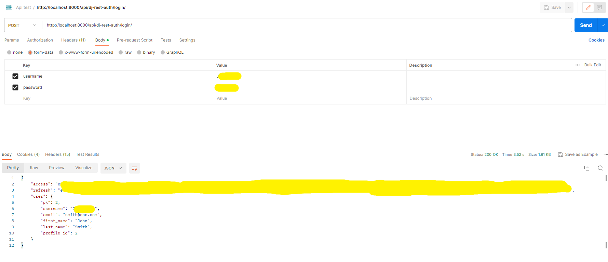<br/>
❌ Incorrect Password<br/>
If the credentials are incorrect, the API should return an error message.<br/>
<br/>
### 🔄 Refresh Access Token<br/>
**Endpoint:** POST /api/dj-rest-auth/token/refresh/<br/>
This endpoint allows users to refresh their access token using a valid refresh token.<br/>
<br/>
### 🚪 Log Out <br/>
**Endpoint:** POST /api/dj-rest-auth/logout/<br/>
This endpoint logs out the user by invalidating the authentication token.<br/>
<br/>
### Sign Up (User Registration)<br/>
📝 Register a New User<br/>
**Endpoint**: POST /api/dj-rest-auth/registration/<br/>
This endpoint allows a new user to create an account.<br/>
✅ Correct Request<br/>
<br/>
❌ Incorrect Request<br/>
<br/>
### Get User Profile<br/>
👤 Retrieve User Profile<br/>
**Endpoint:** GET /api/user-profiles/{id}/<br/>
Fetches the details of a user profile by providing the user’s ID.<br/>
<br/>
### Update User Profile
✏️ Edit Profile (Owner Only)
**Endpoint:** PUT /api/user-profiles/{id}/
✅ Correct Request<br/>
Allows the owner of the profile to update their details.
<br/>
❌ Incorrect Request<br/>
If a user tries to edit someone else’s profile, the system should return an error.<br/>
<br/>
### 🔒 Change Password<br/>
**Endpoint:** POST /api/dj-rest-auth/password/change/<br/>
✅ Successful Request<br/>
Allows an authenticated user to change their password.<br/>
<br/>
❌ Incorrect Old Password<br/>
The user enters an incorrect `old_password`.<br/>
<br/>
❌ New Password is Too Short<br/>
The `new_password1` does not meet the password length requirement.<br/>
<br/>
❌ Passwords Do Not Match<br/>
The `new_password1` and `new_password2` do not match.<br/>
<br/>
### 🛠️ Partner Management<br/>
✅ Get Partner List<br/>
**Endpoint:** GET /api/partners/{id}/<br/>
Returns a list of all available partners.<br/>
<br/>
✅ Get Partner<br/>
**Endpoint:** GET /api/partners/<br/>
Returns the partner details.<br/>
<br/>
✅ Create Partner (Correct Request)<br/>
**Endpoint:** POST /api/partners/<br/>
Create the partner.<br/>
<br/>
❌ Create Partner (Incorrect Request)
If required fields are missing or invalid, the system should return a validation error.
<br/>
✅ Update Partner (Correct Request)<br/>
**Endpoint:** PUT /api/partners/{id}/
If the request is valid, the partner information should be updated successfully.
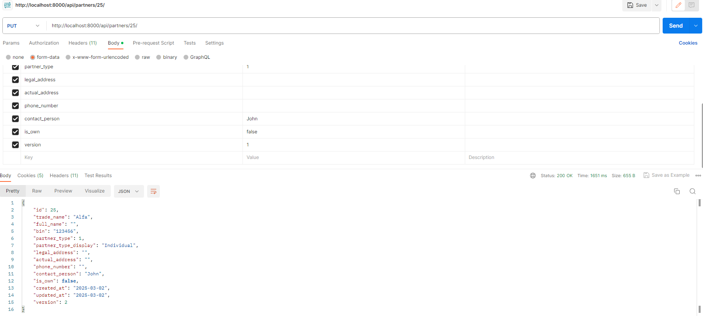<br/>
❌ Update Partner (Incorrect Request)<br/>
If the request has invalid data, the system should return a validation error.<br/>
<br/>
✅ Delete Partner (No References)<br/>
**Endpoint:** DELETE /api/partners/{id}/<br/>
<br/>
If the partner is not referenced elsewhere, it should be deleted successfully.<br/>
❌ Delete Partner (Has References)<br/>
<br/>
If the partner is referenced in other objects, the system should prevent deletion and return an error.<br/>
✅ Lock Partner (Correct Request)<br/>
**Endpoint:** POST /api/partners/{id}/lock/<br/>
If the partner is available, the system should successfully lock it.<br/>
<br/>
❌ Lock Partner (Already Locked by Another User)<br/>
If another user has already locked the partner, the system should return an error.<br/>
<br/>
✅ Unlock Partner (Correct Request)<br/>
**Endpoint:** POST /api/partners/{id}/unlock/<br/>
If the partner is currently locked and the user is authorized, it should be unlocked successfully.<br/>
<br/>
❌ Unlock Partner (Locked by Another User)<br/>
If the partner is locked by someone else, the system should return an error preventing the unlock.<br/>
<br/>
### 🏢 Partner Types<br/>
**Endpoint:** GET http://localhost:8000/api/partner-types/<br/>
Returns the available types of partners.<br/>
<br/>
### 💳 Payment Requests<br/>
✅ Get Payment Request List<br/>
**Endpoint:** GET /api/payment-request/<br/>
Returns a list of all available payment requests.<br/>
<br/>
✅ Get Payment Request<br/>
**Endpoint:** GET /api/payment-request/{id}/<br/>
Returns the payment request's details.<br/>
<br/>
✅ Create Payment Request (Correct Request)<br/>
Endpoint: POST /api/payment-request/<br/>
<br/>
❌ Create Payment Request (Incorrect Request)<br/>
If required fields are missing or invalid, the system should return a validation error.<br/>
<br/>
✅ Update Payment Request (Correct Request)<br/>
**Endpoint:** PUT /api/payment-request/{id}/<br/>
If the request is valid, the payment request should be updated successfully.<br/>
<br/>
❌ Update Payment Request (Incorrect Request)<br/>
If the request has invalid data, the system should return a validation error.<br/>
<br/>
✅ Delete Payment Request(Correct Request)<br/>
**Endpoint:** DELETE /api/payment-request/{id}/<br/>
If the payment request is not referenced elsewhere, it should be deleted successfully.<br/>
<br/>
❌ Delete Payment Request(Incorrect Request)<br/>
If the payment request is referenced in other objects, the system should prevent deletion and return an error.<br/>
<br/>
✅ Lock Payment Request (Correct Request)<br/>
**Endpoint:** POST /api/payment-request/{id}/lock/<br/>
If the payment request is available, the system should successfully lock it.<br/>
<br/>
❌ Lock Payment Request (owned by Another User)<br/>
If another user has already locked the payment request, the system should return an error.<br/>
<br/>
✅ Unlock Payment Request (Correct Request)<br/>
**Endpoint:** POST /api/payment-request/{id}/unlock/<br/>
If the payment request is currently locked and the user is authorized, it should be unlocked successfully.<br/>
<br/>
❌ Unlock Payment Request (owned by Another User)<br/>
If the payment request is locked by someone else, the system should return an error preventing the unlock.<br/>
<br/>
### ✅ Statuses<br/>
**Endpoint:** GET /api/payment-request-statuses/<br/>
Returns the available statuses of payment requests.<br/>
<br/>

## Performance Testing
To ensure the application is optimized and performs efficiently, we use **[Lighthouse](https://developers.google.com/web/tools/lighthouse)** for performance testing. 

Lighthouse is an open-source, automated tool for improving the quality of web pages. It provides insights and metrics across several categories, including:

1. **Performance**: Evaluates load times, speed indices, and how quickly key content is displayed.
2. **Accessibility**: Checks the site's compliance with accessibility standards.
3. **Best Practices**: Analyzes adherence to modern web development practices.
4. **SEO**: Assesses the website's ability to rank on search engines.
5. **Progressive Web App (PWA)**: Verifies the features and reliability of a PWA (if applicable).
- Home<br/>
<br/>
- Sign In<br/>
<br/>
- Sign Up<br/>
<br/>
- Sign Out<br/>
<br/>
- User Profile<br/>
<br/>
- Edit User Profile<br/>
<br/>
- User Profile (Change Password)<br/>
<br/>
- Partners List<br/>
<br/>
- Add Partners<br/>
<br/>
- View Partners<br/>
<br/>
- Edit Partners<br/>
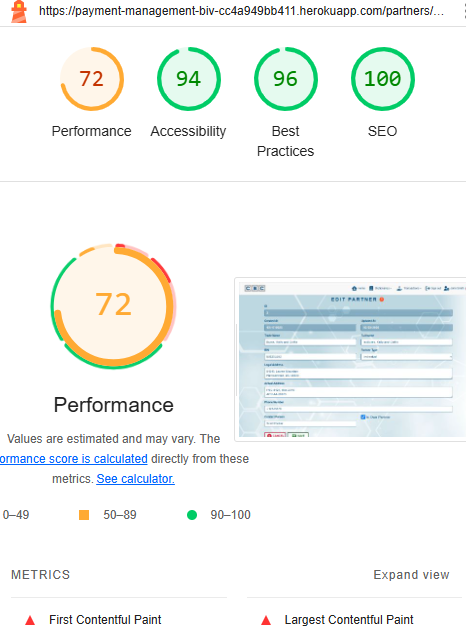<br/>
- Delete Partners<br/>
<br/>
- Payment Requests List<br/>
<br/>
- Add Payment Requests<br/>
<br/>
- View Payment Requests<br/>
<br/>
- Edit Payment Requests<br/>
<br/>
- Delete Payment Requests<br/>
<br/>

## User Interface Testing

Ensuring a consistent and responsive user interface across different screen sizes is crucial for an optimal user experience. Here are the steps and considerations for UI testing:

### Displaying on Different Screens
The application was tested on various screen sizes and devices to ensure responsiveness and usability:
1. **Desktop Screens**: Verify layout and design on common resolutions like 1920x1080 and 1366x768.
2. **Tablet Screens**: Check functionality and layout for resolutions such as 768x1024 (portrait) and 1024x768 (landscape).
3. **Mobile Screens**: Test responsiveness on small screens like 360x640 and 375x667.
- Home<br/>
<br/>
- Sign In<br/>
<br/>
- Sign Up<br/>
<br/>
- Sign Out<br/>
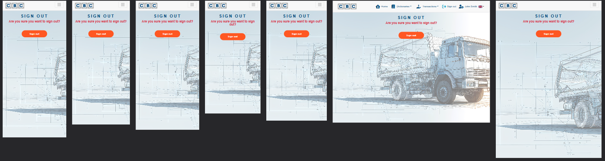<br/>
- User Profile<br/>
<br/>
- Edit User Profile<br/>
<br/>
- User Profile (Change Password)<br/>
<br/>
- Partners List<br/>
<br/>
- Add Partners<br/>
<br/>
- View Partners<br/>
<br/>
- Edit Partners<br/>
<br/>
- Delete Partners<br/>
<br/>
- Payment Requests List<br/>
<br/>
- Add Payment Requests<br/>
<br/>
- View Payment Requests<br/>
<br/>
- Edit Payment Requests<br/>
<br/>
- Delete Payment Requests<br/>
<br/>

### Testing on Different Browsers
The following browsers are commonly tested to ensure broad compatibility:
**Google Chrome**: Latest version and recent updates.
- Home<br/>
<br/>
- Sign In<br/>
<br/>
- Sign Up<br/>
<br/>
- Sign Out<br/>
<br/>
- User Profile<br/>
<br/>
- Edit User Profile<br/>
<br/>
- User Profile (Change Password)<br/>
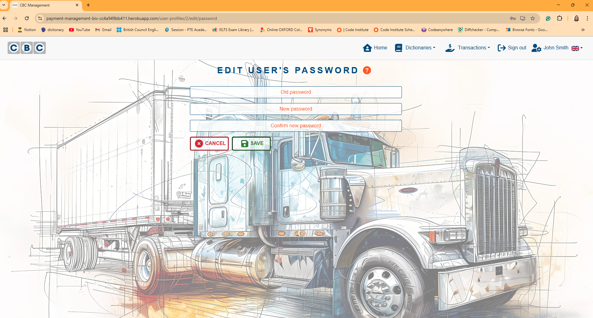<br/>
- Partners List<br/>
<br/>
- Add Partners<br/>
<br/>
- View Partners<br/>
<br/>
- Edit Partners<br/>
<br/>
- Delete Partners<br/>
<br/>
- Payment Requests List<br/>
<br/>
- Add Payment Requests<br/>
<br/>
- View Payment Requests<br/>
<br/>
- Edit Payment Requests<br/>
<br/>
- Delete Payment Requests<br/>
<br/>

**Mozilla Firefox**: Standard version and ESR (Extended Support Release).
- Home<br/>
<br/>
- Sign In<br/>
<br/>
- Sign Up<br/>
<br/>
- Sign Out<br/>
<br/>
- User Profile<br/>
<br/>
- Edit User Profile<br/>
<br/>
- User Profile (Change Password)<br/>
<br/>
- Partners List<br/>
<br/>
- Add Partners<br/>
<br/>
- View Partners<br/>
<br/>
- Edit Partners<br/>
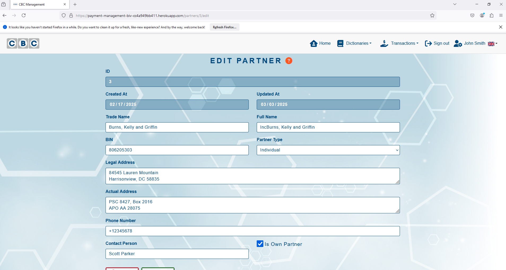<br/>
- Delete Partners<br/>
<br/>
- Payment Requests List<br/>
<br/>
- Add Payment Requests<br/>
<br/>
- View Payment Requests<br/>
<br/>
- Edit Payment Requests<br/>
<br/>
- Delete Payment Requests<br/>
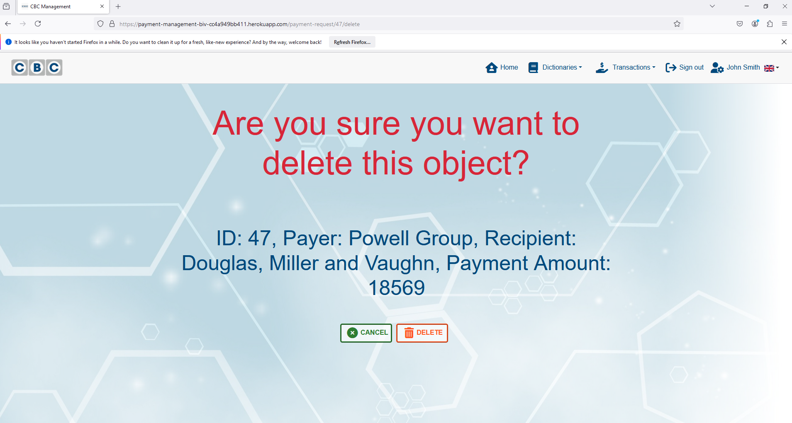<br/>

**Microsoft Edge**: Chromium-based versions.
- Home<br/>
<br/>
- Sign In<br/>
<br/>
- Sign Up<br/>
<br/>
- Sign Out<br/>
<br/>
- User Profile<br/>
<br/>
- Edit User Profile<br/>
<br/>
- User Profile (Change Password)<br/>
<br/>
- Partners List<br/>
<br/>
- Add Partners<br/>
<br/>
- View Partners<br/>
<br/>
- Edit Partners<br/>
<br/>
- Delete Partners<br/>
<br/>
- Payment Requests List<br/>
<br/>
- Add Payment Requests<br/>
<br/>
- View Payment Requests<br/>
<br/>
- Edit Payment Requests<br/>
<br/>
- Delete Payment Requests<br/>
<br/>
 
## Automated Testing
This project includes a suite of automated tests to ensure the functionality, reliability, and stability of the application. Below is an overview of the testing setup, the process, and the results.
### Django
1. **Running the Tests**
You can run the test suite using the Django management command:
```bash
python manage.py test
```
2. **Testing Structure**
The tests are located in a dedicated tests folder for each app. Below is an example of the folder structure:
```
app_name/
├── test-cases/
│   ├── test_models.py
│   ├── test_views.py
│   ├── ...
```
3. **Key Test Results**
After running the tests, here are the results obtained from the project:
- Command: `Python manage.py test`
- Output Summary:
**common**
```
----------------------------------------------------------------------
Ran 16 tests in 6.370s

OK
```
**django_api**
```
.......
----------------------------------------------------------------------
Ran 7 tests in 0.408s

OK
```
**partner**
```
..................
----------------------------------------------------------------------
Ran 18 tests in 1.399s

OK
```
**payment**
```
......................
----------------------------------------------------------------------
Ran 22 tests in 4.677s

OK
```
**user**
```
...................
----------------------------------------------------------------------
Ran 19 tests in 5.960s

OK
```

- Code Coverage:
  - Prerequisites:
  Before getting reports, make sure you have installed all the dependencies by running:
  ```bash
  pip install coverage
  ```
  - Command:
  ```bash
  coverage run --source=app_name manage.py test app_name
  coverage report
  ```
  - Results:

  **common**

    

  **django_api**

    

  **partner**

    

  **payment**

    

  **user**

    

### Jest
1. **Prerequisites**
Before running the tests, make sure you have installed all the dependencies by running:
```bash
npm install
```
2. **Running the Tests**
To run the test suite, use the following command:
```bash
npm test
```
3. **Key Test Results**
After running the tests, here are the results obtained from the project:
- Command: `npm test`
- Output Summary:
  

## Validation
### W3C Validator (HTML)
Quality checking was tested by [Markup validator service](https://validator.w3.org/)<br/>
During validation, warnings may appear related to the following role attributes in `react-table`:<br/>
- `role="table"` on `<table>` elements<br/>
- `role="rowgroup"` on `<tbody>` elements<br/>
- `role="row"` on `<tr>` elements<br/>
- `role="columnheader"` on `<th>` elements<br/>
- `role="cell"` on `<td>` elements<br/>
These warnings **do not affect** the performance or functionality of the web application.<br/>
**Why Do These Warnings Occur?**<br/>
- **Automatic Addition by** `react-table` – These attributes are added to improve accessibility.
- **Redundant with Native HTML Semantics** – Elements like `<table>` and `<tr>` already have built-in roles, making explicit role attributes unnecessary.
- **Validator Flags but No Functional Impact** – The W3C validator highlights them as redundant, but they **do not break accessibility or usability**.<br/>
**Impact on Performance and Functionality**
- ✅ **No Performance Impact** – These warnings are **purely related to HTML validation** and do not slow down rendering.
- ✅ **Full Functionality Maintained** – The `react-table` component continues to work as expected, including sorting, filtering, and pagination.
- ✅ **No SEO or Accessibility Issues** – Search engines and screen readers still **interpret the table correctly**, as the additional `role` attributes do not interfere with parsing.

These validation warnings are **harmless** and can be safely ignored. Since they are **generated by** `react-table` **internally**, modifying them would require changing the component itself, which is unnecessary.

- Home<br/>
<br/>
- Sign In<br/>
<br/>
- Sign Up<br/>
<br/>
- Sign Out<br/>
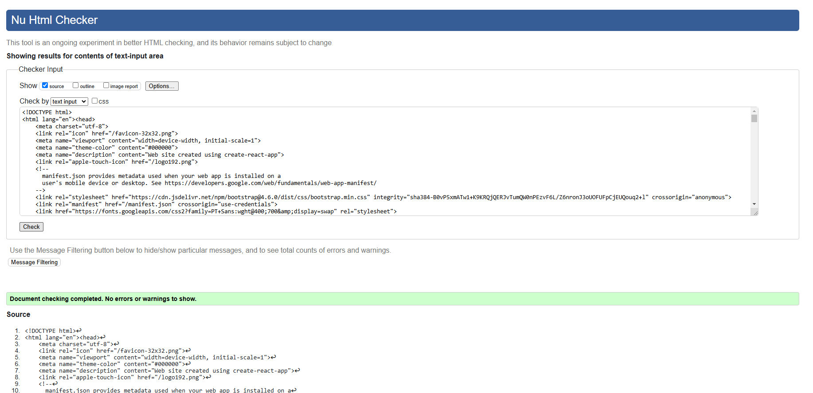<br/>
- User Profile<br/>
<br/>
- Edit User Profile<br/>
<br/>
- User Profile (Change Password)<br/>
<br/>
- Partners List<br/>
<br/>
- Add Partners<br/>
<br/>
- View/Edit Partners<br/>
<br/>
- Delete Partners<br/>
<br/>
- Payment Requests List<br/>
<br/>
- Add Payment Requests<br/>
<br/>
- View/Edit Payment Requests<br/>
<br/>
- Delete Payment Requests<br/>
<br/>

### W3C CSS Validator (CSS)
Quality checking was tested by [CSS validator service](https://jigsaw.w3.org/css-validator/).
During validation, warnings may appear stating:
- **"Due to their dynamic nature, CSS variables are currently not statically checked."**
- "`-apple-system, BlinkMacSystemFont, 'Segoe UI', 'Roboto', 'Oxygen', 'Ubuntu', 'Cantarell', 'Fira Sans', 'Droid Sans', 'Helvetica Neue', sans-serif` is a vendor extension."
- "`-webkit-font-smoothing` is a vendor extension."
- "`-moz-osx-font-smoothing` is a vendor extension."

**Why Does This Warning Occur?**
- **CSS Variables:** These are resolved dynamically at runtime, meaning static validators cannot precompute their final values.
- **Vendor Extensions** (`-webkit-`, `-moz-`): These are browser-specific properties used to enhance font rendering and ensure consistency across different operating systems.
- **Font Stack Warning:** The inclusion of `-apple-system` and `BlinkMacSystemFont` in the font stack is intentional to **optimize typography across platforms**, but some validators flag them as vendor-specific.
**Impact on Performance and Functionality**
✅ **No Performance Impact** – This warning does not affect page load speed, rendering, or responsiveness.
✅ **Full CSS Functionality** – The styles remain fully functional across supported browsers.
✅ **Cross-Browser Optimization** – Vendor-prefixed properties **improve rendering consistency** rather than causing issues.
✅ **No Accessibility Concerns** – Screen readers and search engines are unaffected by these warnings.

These warnings are **purely informational and can be safely ignored**. They do not affect the web app's **performance, usability, or compatibility** but instead help ensure a **consistent user experience across browsers and devices**. 

- App.module.css<br/>
<br/>
- index.css<br/>
<br/>
- BgImage.module.css<br/>
<br/>
- Button.module.css<br/>
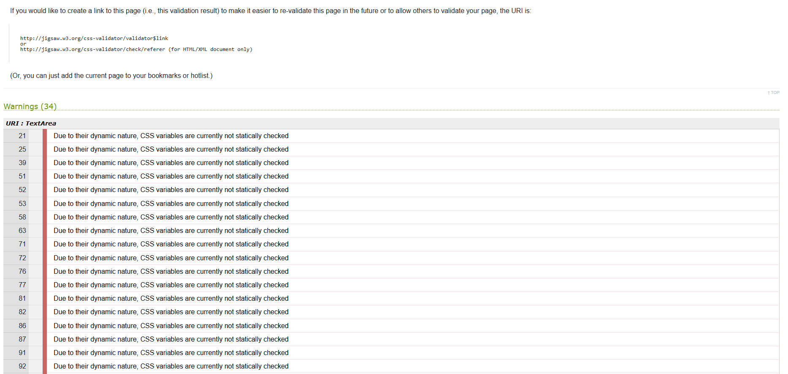<br/>
- CardCollection.module.css<br/>
<br/>
- DataTable.module.css<br/>
<br/>
- Header.module.css<br/>
<br/>
- Home.module.css<br/>
<br/>
- Input.module.css<br/>
<br/>
- Instruction.module.css<br/>
<br/>
- LanguageSelector.module.css<br/>
<br/>
- NavBar.module.css<br/>
<br/>
- NotFound.module.css<br/>
<br/>
- ObjectDelete.module.css<br/>
<br/>
- ObjectList.module.css<br/>
<br/>
- ObjectSelect.module.css<br/>
<br/>
- ObjectView.module.css<br/>
<br/>
- SignInUpForm.module.css<br/>
<br/>
- SignOutForm.module.css<br/>
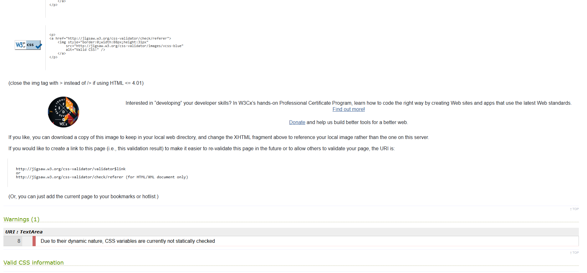<br/>
- Spinners.module.css<br/>
<br/>
- ToastContext.module.css<br/>
<br/>
- UserProfilePage.module.css<br/>
<br/>
- variables.css<br/>
<br/>

### Validator PEP8 (Python)
Quality checking was tested by [PEP8](https://pep8ci.herokuapp.com/#).
All files were checked and did not have errors or warnings.
Notes: Each Python file contains a newline at the end of the file.

**common**
- mixins/pessimistic_locking_view.py

  

- test_cases/test_models.py

  

- test_cases/test_pessimistic_locking_view.py

  

- test_cases/test_urls.py

  

- models.py

  

**django_api**

- test_cases/test_permissions.py

  

- test_cases/test_serializers.py

  

- permissions.py

  

- serilizers.py

  

- settings.py

  

- urls.py

  

- views.py

  

- wsgi.py

  

**partner**

- commands/create_test_partners.py

  

- test_cases/test_filters.py

  

- test_cases/test_models.py

  

- test_cases/test_serializers.py

  

- test_cases/test_views.py

  

- admin.py

  

- apps.py

  

- filters.py

  

- models.py

  

- serilizers.py

  

- urls.py

  

- views.py

  

**payment**

- commands/create_test_payment_request.py

  

- test_cases/test_filters.py

  

- test_cases/test_models.py

  

- test_cases/test_serializers.py

  

- test_cases/test_views.py

  

- admin.py

  

- apps.py

  

- filters.py

  

- models.py

  

- serilizers.py

  

- urls.py

  

- views.py

  

**user**

- test_cases/test_models.py

  

- test_cases/test_serializers.py

  

- test_cases/test_views.py

  

- admin.py

  

- apps.py

  

- models.py

  

- serilizers.py

  

- urls.py

  

- views.py

  

### JavaScript Quality Validation<br/>
The project has been checked using ESLint to ensure code quality and compliance with best practices. The validation process included:<br/>
- Checking for syntax errors, unused variables, and potential bugs.<br/>
- Verifying adherence to the configured coding standards.<br/>
- Reviewing and addressing any reported issues or warnings.<br/>
**What is ESLint?**<br/>
ESLint is a powerful tool for identifying and fixing problems in JavaScript and TypeScript code. It helps enforce coding standards, detect potential errors, and improve overall code quality.<br/>

**Advantages of Using ESLint**<br/>
✅ **Error Prevention** – Detects syntax errors, undefined variables, and problematic patterns before execution.<br/>
✅ **Code Consistency** – Enforces a uniform coding style across the project.<br/>
✅ **Improved Readability** – Helps maintain clean, structured, and easy-to-read code.<br/>
✅ **Better Debugging** – Highlights issues early in development, reducing debugging time.<br/>
✅ **Customizable Rules** – Supports custom configurations to match project-specific requirements.<br/>
✅ **Integration with Code Editors** – Works seamlessly with VS Code, WebStorm, and other editors for real-time linting.<br/>

1. **Prerequisites**<br/>
Before running ESLint, ensure all dependencies are installed:<br/>
```
npm install
```
2. **Running ESLint**<br/>
To analyze code quality and detect potential issues, run:<br/>
```
npx eslint src
```
3. **Generating an HTML Report**<br/>
For a detailed HTML report, use:<br/>
```
npx eslint src --format html --output-file eslint-report.html
```
Open eslint-report.html in a browser to view the results visually.<br/>

4. **Key Findings**<br/>
After running ESLint, the results will include:<br/>
- **Errors:** Critical issues that must be fixed.<br/>
- **Warnings:** Best practices and recommendations.<br/>
- **Unused Variables:** Variables declared but never used.<br/>
- ** Code Style Issues:** Enforcing consistent formatting (if a style guide is used).<br/>

🔍 Understanding Warnings<br/>
Some warnings, such as:<br/>
```sh
... Warning React Hook useEffect has missing dependencies: .... Either include them or remove the dependency array. react-hooks/exhaustive-deps
```
are **not actual problems** but recommendations to ensure correctness. These warnings help prevent unintended behavior but do not necessarily indicate an issue affecting performance or functionality.<br/>

5. **Outcomes**<br/>
The project was checked using ESLint, ensuring code quality and best practices.<br/>
📄 View the ESLint Report: [link](./react_frontend/eslint-report.html)<br/>
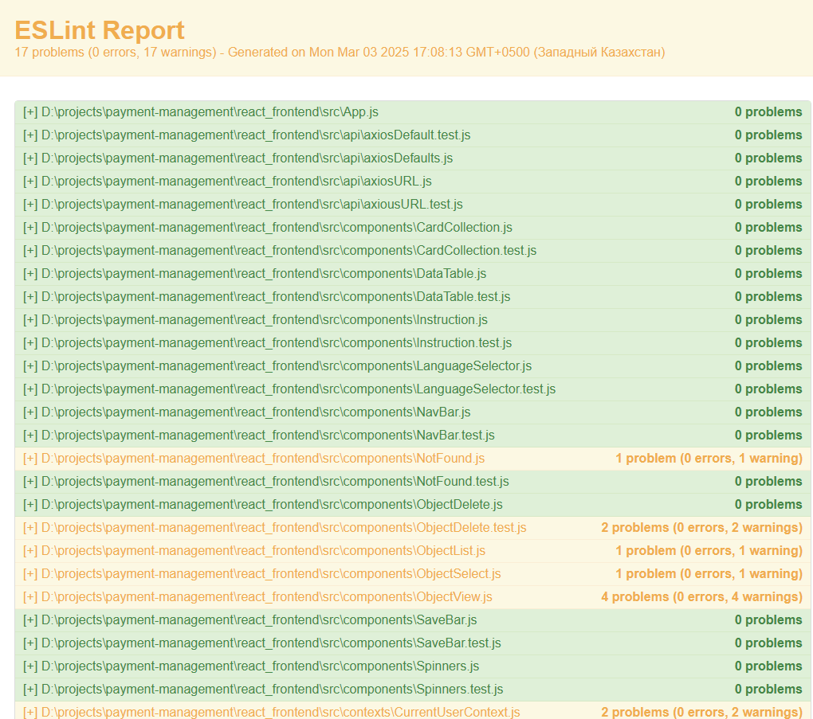

## Bugs

### Solved Bugs
#### 1. Fix changing version to pessimistic_locking_view.py. request is mutable
**Issue:**  
The `request` object is mutable, which can cause unexpected behavior when modifying its data directly.  

**Solution:**  
Create a copy of `request.data` before modifying it to ensure immutability.  

**Fixed Code:**
```python
if isinstance(request.data, QueryDict):
    data = request.data.copy()
else:
    data = request.data
data["version"] = instance.version + 1
with transaction.atomic():
    self.unlock_item(request, instance)
    serializer = self.get_serializer(instance, data=data, partial=True)
    serializer.is_valid(raise_exception=True)
    self.perform_update(serializer)
    return Response(serializer.data, status=status.HTTP_200_OK)
```
#### 2. Fix: Preventing Errors When Accessing a Non-Existent Item in `ObjectList.js`
**Issue:**
When a user tries to open a view for an item that doesn't exist, the frontend crashes due to an unhandled 404 error.

**Solution:**
Introduce an `isExist` state. If the API response returns a 404 error, set `isExist` to false to handle the missing item gracefully.

Fixed Code:
```javascript
const [isExist, setIsExist] = useState(true);

...

if (err.response?.status === 404) {
    setIsExist(false);
}

...

{isExist ? (
  ...
) : (
  <p className={headerStyles.HeaderNotFound}>
    {t("toast.no_results_found")}
  </p>
)}
```
#### 3. Fix: Language Selector Closes Prematurely When Clicking the Flag Image
**Issue:**
When a user clicks on the flag image in the language selector, the dropdown menu closes immediately, disrupting the user experience.

**Solution:**
Modify the event handler to ignore clicks on the flag image, preventing unintended menu closure.

**Fixed Code:**
```javascript
if (
  ref.current &&
  !ref.current.contains(event.target) &&
  !event.target.classList.contains("dropdown-toggle") &&
  !event.target.classList.contains(lngStyles.ImgFlag)
) {
  setExpanded(false);
}
```
### Unsolved Bugs

 - None.

### Mistakes

 - Using different formats of 'Commit' comments.
 - Some grammar and spelling mistakes.