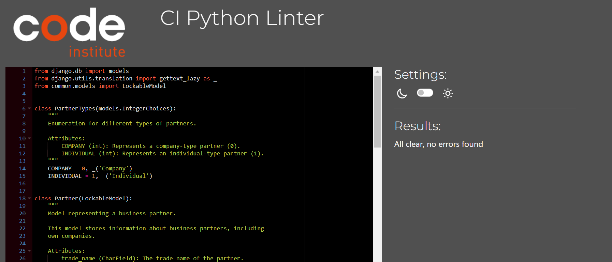

## TESTING

### Purpose Of Testing

The purpose of testing is to make sure the application does not have critical errors and works properly, providing a positive experience for the user.

## Functional Testing

Functional testing ensures that all features and functionalities of the application work as expected, regardless of the device or screen size.

| feature | action | expected result | tested | passed | comments |
| --- | --- | --- | --- | --- | --- |


## Admin Panel Functional Testing

Admin panel testing ensures that the admin interface works as expected and provides the correct functionality for managing the application's data.

| feature | action  | expected result  | tested | passed | comments |
|---|---|---|----|---|---|


### Admin Panel Access Control

| feature | action | expected result  | tested | passed | comments |
|---|---|---|---|---|---|
| Admin login without permissions | Log in as a non-admin user | The system prevents access to the admin panel and redirects to the home page or appropriate page. | Yes | Yes | - |
| Access control on models | Log in as an admin user and navigate to various models | The admin user has access to all models, can add/edit/delete data, and access restricted functionalities. | Yes | Yes | - |

## Testing User Stories


## Performance Testing
To ensure the application is optimized and performs efficiently, we use **[Lighthouse](https://developers.google.com/web/tools/lighthouse)** for performance testing. 

Lighthouse is an open-source, automated tool for improving the quality of web pages. It provides insights and metrics across several categories, including:

1. **Performance**: Evaluates load times, speed indices, and how quickly key content is displayed.
2. **Accessibility**: Checks the site's compliance with accessibility standards.
3. **Best Practices**: Analyzes adherence to modern web development practices.
4. **SEO**: Assesses the website's ability to rank on search engines.
5. **Progressive Web App (PWA)**: Verifies the features and reliability of a PWA (if applicable).
- the 'Home' page

## User Interface Testing

Ensuring a consistent and responsive user interface across different screen sizes is crucial for an optimal user experience. Here are the steps and considerations for UI testing:

### Displaying on Different Screens
The application was tested on various screen sizes and devices to ensure responsiveness and usability:
1. **Desktop Screens**: Verify layout and design on common resolutions like 1920x1080 and 1366x768.
2. **Tablet Screens**: Check functionality and layout for resolutions such as 768x1024 (portrait) and 1024x768 (landscape).
3. **Mobile Screens**: Test responsiveness on small screens like 360x640 and 375x667.
- the 'Home' page

### Testing on Different Browsers
The following browsers are commonly tested to ensure broad compatibility:
**Google Chrome**: Latest version and recent updates.
- the 'Home' page

**Mozilla Firefox**: Standard version and ESR (Extended Support Release).
- the 'Home' page

**Microsoft Edge**: Chromium-based versions.
- the 'Home' page
 
## Automated Testing
This project includes a suite of automated tests to ensure the functionality, reliability, and stability of the application. Below is an overview of the testing setup, the process, and the results.
### Django
1. **Running the Tests**
You can run the test suite using the Django management command:
```
python manage.py test
```
2. **Testing Structure**
The tests are located in a dedicated tests folder for each app. Below is an example of the folder structure:
```
app_name/
├── test-cases/
│   ├── test_models.py
│   ├── test_views.py
│   ├── ...
```
3. **Key Test Results**
After running the tests, here are the results obtained from the project:
- Command: `Python manage.py test`
- Output Summary:
**common**
```
----------------------------------------------------------------------
Ran 16 tests in 6.370s

OK
```
**django_api**
```
.......
----------------------------------------------------------------------
Ran 7 tests in 0.408s

OK
```
**partner**
```
..................
----------------------------------------------------------------------
Ran 18 tests in 1.399s

OK
```

- Code Coverage:
  - Prerequisites:
  Before getting reports, make sure you have installed all the dependencies by running:
  ```
  pip install coverage
  ```
  - Command:
  ```
  coverage run --source=app_name manage.py test app_name
  coverage report
  ```
  - Results:

  **common**

    

  **django_api**

    

  **partner**

    

### Jest (React)
1. **Prerequisites**
Before running the tests, make sure you have installed all the dependencies by running:
```
npm install
```
2. **Running the Tests**
To run the test suite, use the following command:
```
npm test
```
3. **Key Test Results**
After running the tests, here are the results obtained from the project:
- Command: `npm test`
- Output Summary:
  

## Validation
### W3C Validator (HTML)
Quality checking was tested by [Markup validator service](https://validator.w3.org/)
All files were checked and did not have errors.
These warnings do not indicate issues that would degrade the user experience or functionality of the application. The `aria-label` attributes were added deliberately to enhance accessibility for screen readers. The use of `aria-label` conforms to accessibility best practices by providing explicit descriptions when needed. The warnings do not affect the semantic correctness or performance of the application.
- the 'Home' page

### W3C CSS Validator (CSS)
Quality checking was tested by [CSS validator service](https://jigsaw.w3.org/css-validator/).
All files were checked and did not have errors or warnings.


### JS Hint
Quality checking was tested by [JS Hint](https://jshint.com/).
All files were checked and did not have errors or warnings.
- dashboard.js
 
### Validator PEP8 (Python)
Quality checking was tested by [PEP8](https://pep8ci.herokuapp.com/#).
All files were checked and did not have errors or warnings.
Notes: Each Python file contains a newline at the end of the file.

**common**
- mixins/pessimistic_locking_view.py

  

- test_cases/test_models.py

  

- test_cases/test_pessimistic_locking_view.py

  

- test_cases/test_urls.py

  

- models.py

  

**django_api**

- test_cases/test_permissions.py

  

- test_cases/test_serializers.py

  

- permissions.py

  

- serilizers.py

  

- settings.py

  

- urls.py

  

- views.py

  

- wsgi.py

  

**partner**

- commands/create_test_partners.py

  

- test_cases/test_filters.py

  

- test_cases/test_models.py

  

- test_cases/test_serializers.py

  

- test_cases/test_views.py

  

- admin.py

  

- apps.py

  

- filters.py

  

- models.py

  

- serilizers.py

  

- urls.py

  

- views.py

  


## Bugs

__Solved Bugs__

   
__Unsolved Bugs__

 - None.

__Mistakes__

 - Using different formats of 'Commit' comments.
 - Some grammar and spelling mistakes.